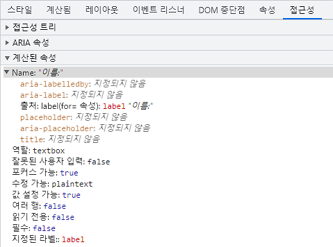
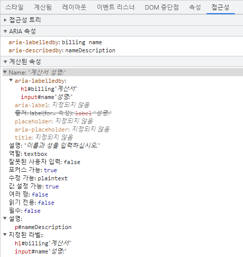

<script setup>
import CodepenSnippet from './accessibility-demos/CodepenSnippet.vue'
</script>

# 접근성

웹 접근성(a11y라고도 함)은 장애가 있는 사람, 네트워크 속도가 느린 사람, 오래되거나 손상된 하드웨어 또는 단순히 낙후된 환경에 있는 사람 등 누구나 사용할 수 있는 웹사이트를 만드는 것 입니다.
예를 들어, 비디오에 자막을 추가하면 청각 장애인, 난청 및 시끄러운 환경에서 소리를 들을 수 없는 사용자 모두에게 도움이 됩니다.
마찬가지로 텍스트의 대비가 너무 낮지 않은지 확인하면,
시력이 약하거나 밝은 햇빛 아래에서 휴대전화를 사용하는 사용자 모두에게 도움이 됩니다.

시작할 준비가 되었지만 어디서부터 시작해야할지 모르겠습니까 ?

[월드 와이드 웹 컨소시엄(W3C)](https://www.w3.org/)에서 제공하는 [웹접근성 기획 및 관리](https://www.w3.org/WAI/planning-and-managing/)를 확인하세요.

:::info 참고
이 가이드에 첨부된 크롬 개발자도구 스크린샷은 한글화가 적용되어 있습니다. 크롬 개발자도구 한글화에 대한 자세한 방법은 [여기](https://developer.chrome.com/ko/blog/new-in-devtools-94/#localized)를 참고하십시오.
:::

## 건너뛰기 링크

사용자가 여러 웹 페이지에서 반복되는 콘텐츠를 건너뛸 수 있도록 각 페이지 상단에 기본 콘텐츠 영역으로 직접 연결되는 링크를 추가해야 합니다.

일반적으로 이것은 모든 페이지의 첫 번째 포커스 가능한 엘리먼트가 되기 때문에 `App.vue` 상단에서 수행됩니다:

```vue-html
<ul class="skip-links">
  <li>
    <a href="#main" ref="skipLink">주요 콘텐츠로 건너뛰기</a>
  </li>
</ul>
```

아래 스타일을 추가해 포커스가 되지 않은 링크를 숨길 수 있습니다:

```css
.skipLink {
  white-space: nowrap;
  margin: 1em auto;
  top: 0;
  position: fixed;
  left: 50%;
  margin-left: -72px;
  opacity: 0;
}
.skipLink:focus {
  opacity: 1;
  background-color: white;
  padding: 0.5em;
  border: 1px solid black;
}
```

사용자가 경로를 변경하면 건너뛰기 링크로 포커스를 다시 가져옵니다.
이것은 템플릿 ref의 건너뛰기 링크에 포커스를 호출하여 구현할 수 있습니다(`vue-router` 사용 가정):

<div class="options-api">

```vue
<script>
export default {
  watch: {
    $route() {
      this.$refs.skipLink.focus()
    }
  }
}
</script>
```

</div>
<div class="composition-api">

```vue
<script setup>
import { ref, watch } from 'vue'
import { useRoute } from 'vue-router'

const route = useRoute()
const skipLink = ref()

watch(
  () => route.path,
  () => {
    skipLink.value.focus()
  }
)
</script>
```

</div>

[주요 콘텐츠로 건너뛰기 링크에 대한 설명서 읽기](https://www.w3.org/WAI/WCAG21/Techniques/general/G1.html)

## 콘텐츠 구조

접근성의 가장 중요한 부분 중 하나는 디자인이 접근성 구현을 지원할 수 있는지 확인하는 것입니다.
디자인은 색상 대비, 글꼴 선택, 텍스트 크기 및 언어뿐만 아니라 앱에서 콘텐츠가 구성되는 방식도 고려해야 합니다.

### 제목

사용자는 제목을 통해 앱을 탐색할 수 있습니다.
앱의 모든 섹션에 제목이 있으면, 사용자가 각 섹션의 내용을 더 쉽게 예측할 수 있습니다.
제목과 관련하여 몇 가지 권장되는 접근성이 있습니다.

- 순위에 따라 제목 삽입: `<h1>` - `<h6>`
- 섹션 내에서 제목을 건너뛰지 않기.
- 제목의 시각적 모양을 제공하기 위해 텍스트 스타일 지정 대신 실제 제목 태그를 사용.

[제목에 대해 자세히 알아보기](https://www.w3.org/TR/UNDERSTANDING-WCAG20/navigation-mechanisms-descriptive.html)

```vue-html
<main role="main" aria-labelledby="main-title">
  <h1 id="main-title">메인 제목</h1>
  <section aria-labelledby="section-title">
    <h2 id="section-title"> 섹션 제목 </h2>
    <h3>섹션 부 제목</h3>
    <!-- 콘텐츠 -->
  </section>
  <section aria-labelledby="section-title">
    <h2 id="section-title"> 섹션 제목 </h2>
    <h3>섹션 부 제목</h3>
    <!-- 콘텐츠 -->
    <h3>섹션 부 제목</h3>
    <!-- 콘텐츠 -->
  </section>
</main>
```

### 랜드마크

[랜드마크](https://developer.mozilla.org/en-US/docs/Web/Accessibility/ARIA/Roles/landmark_role)는 앱 내의 섹션에 대한 프로그래밍 방식 접근을 제공합니다.
보조 기술에 의존하는 사용자는 앱의 각 섹션으로 이동하여 콘텐츠를 건너뛸 수 있습니다.
[ARIA roles](https://developer.mozilla.org/en-US/docs/Web/Accessibility/ARIA/Roles)를 사용하여 이를 달성할 수 있습니다.

| HTML            | ARIA Role            | 랜드마크 용도                                                               |
| --------------- | -------------------- |-----------------------------------------------------------------------|
| header          | role="banner"        | 주요 제목: 페이지 제목                                                         |
| nav             | role="navigation"    | 문서 또는 관련 문서를 탐색할 때 사용하기에 적합한 링크 모음                                    |
| main            | role="main"          | 문서의 주요 또는 중심 컨텐츠                                                      |
| footer          | role="contentinfo"   | 상위 문서에 대한 정보: 각주/저작권/개인정보 취급방침 링크                                     |
| aside           | role="complementary" | 메인 컨텐츠를 보조하지만, 분리되어 있고, 그 내용 자체로 독립된 의미가 있음                           |
| _Not available_ | role="search"        | 검색 기능을 구현하기 위해 결합된 모든 엘리먼트를 감싸는 컨테이너 엘리먼트                             |
| form            | role="form"          | 양식에 관련된 엘리먼트를 감싸고 있음                                                  |
| section         | role="region"        | 관련성이 있고 사용자가 탐색하고 싶어할 것 같은 콘텐츠. 이것을 사용한 엘리먼트에는 반드시 `aria-label` 제공 필요 |

:::tip 팁:
[HTML5 시맨틱 엘리먼트를 지원하지 않는 오래된 브라우저](https://caniuse.com/#feat=html5semantic)와 최대한 호환되도록,
랜드마크 HTML 엘리먼트에 (의미적으로 중복되더라도) 랜드마크 role 속성을 사용하는 것이 좋습니다.
:::

[랜드마크에 대해 자세히 알아보기](https://www.w3.org/TR/wai-aria-1.2/#landmark_roles)

## 의미있는 양식 (Semantic form)

양식(form)을 만들 때 `<form>`, `<label>`, `<input>`, `<textarea>`, `<button>` 엘리먼트를 사용할 수 있습니다.

레이블은 일반적으로 양식 필드의 상단이나 왼쪽에 배치됩니다:

```vue-html
<form action="/dataCollectionLocation" method="post" autocomplete="on">
  <div v-for="item in formItems" :key="item.id" class="form-item">
    <label :for="item.id">{{ item.label }}: </label>
    <input
      :type="item.type"
      :id="item.id"
      :name="item.id"
      v-model="item.value"
    />
  </div>
  <button type="submit">제출하기</button>
</form>
```

<CodepenSnippet title="Simple Form" slug="qBxgQeQ" :height="475"/>
<!-- <common-codepen-snippet title="Simple Form" slug="dyNzzWZ" :height="368" tab="js,result" theme="light" :preview="false" :editable="false" /> -->

form 엘리먼트에 `autocomplete='on'`을 포함하면 form의 모든 input에 적용됩니다.
각 input에 대해 다른 [자동 완성 속성 값](https://developer.mozilla.org/en-US/docs/Web/HTML/Attributes/autocomplete)을 설정할 수도 있습니다.

### 레이블

모든 양식의 용도를 설명하는 레이블을 제공합니다.
`for`와 `id` 속성을 사용하여 연결하여:

```vue-html
<label for="name">이름</label>
<input type="text" name="name" id="name" v-model="name" />
```

<CodepenSnippet title="Form Label" slug="jOZdXaY" :height="285"/>
<!-- <common-codepen-snippet title="Form Label" slug="XWpaaaj" :height="265" tab="js,result" theme="light" :preview="false" :editable="false" /> -->

크롬 개발자 도구에서 이 엘리먼트를 검사하고,
엘리먼트 탭에서 접근성 탭을 열면,
`<input>`이 `<label>`에서 이름을 가져오는 방법을 볼 수 있습니다:



:::warning 경고:
다음과 같이 입력 필드를 래핑하는 레이블을 보았을 수도 있습니다:

```vue-html
<label>
  이름:
  <input type="text" name="name" id="name" v-model="name" />
</label>
```

일치하는 ID로 레이블을 명시적으로 설정하는 것이 보조 기술에서 더 잘 지원됩니다.
:::

#### `aria-label`

[`aria-label`](https://developer.mozilla.org/en-US/docs/Web/Accessibility/ARIA/ARIA_Techniques/Using_the_aria-label_attribute)을 사용하여 input에 접근 가능한 이름을 지정할 수도 있습니다.

```vue-html
<label for="name">이름</label>
<input
  type="text"
  name="name"
  id="name"
  v-model="name"
  :aria-label="nameLabel"
/>
```

<CodepenSnippet title="Form ARIA label" slug="JjpxwLQ" :height="285"/>
<!-- <common-codepen-snippet title="Form ARIA label" slug="NWdvvYQ" :height="265" tab="js,result" theme="light" :preview="false" :editable="false" /> -->

크롬 개발자도구에서 이 엘리먼트의 접근 가능한 이름이 어떻게 변경되었는지 확인 해보십시오:


#### `aria-labelledby`

[`aria-labelledby`](https://developer.mozilla.org/en-US/docs/Web/Accessibility/ARIA/ARIA_Techniques/Using_the_aria-labelledby_attribute)를 사용하는 것은 화면에 레이블 텍스트가 표시되는 경우를 제외하고는 `aria-label`과 유사하다.
이는 다른 엘리먼트들과 `id`로 쌍을 이루며, 여러 개의 `id`를 연결할 수 있다:

```vue-html
<form
  class="demo"
  action="/dataCollectionLocation"
  method="post"
  autocomplete="on"
>
  <h1 id="billing">계산서</h1>
  <div class="form-item">
    <label for="name">이름:</label>
    <input
      type="text"
      name="name"
      id="name"
      v-model="name"
      aria-labelledby="billing name"
    />
  </div>
  <button type="submit">제출하기</button>
</form>
```

<CodepenSnippet title="Form ARIA labelledby" slug="JjpxwZg" :height="330"/>
<!-- <common-codepen-snippet title="Form ARIA labelledby" slug="MWJvvBe" :height="265" tab="js,result" theme="light" :preview="false" :editable="false" /> -->


#### `aria-describedby`

[aria-describedby](https://developer.mozilla.org/en-US/docs/Web/Accessibility/ARIA/ARIA_Techniques/Using_the_aria-describedby_attribute)는 사용자에게 필요할 수 있는 설명에 대한 추가 정보를 제공한다는 점을 제외하고는 `aria-labelledby`와 같은 방식으로 사용됩니다.
이것은 input의 특징을 설명하는 데 사용할 수 있습니다:

```vue-html
<form
  class="demo"
  action="/dataCollectionLocation"
  method="post"
  autocomplete="on"
>
  <h1 id="billing">계산서</h1>
  <div class="form-item">
    <label for="name">성명:</label>
    <input
      type="text"
      name="name"
      id="name"
      v-model="name"
      aria-labelledby="billing name"
      aria-describedby="nameDescription"
    />
    <p id="nameDescription">이름과 성을 입력하십시오.</p>
  </div>
  <button type="submit">제출하기</button>
</form>
```

<CodepenSnippet title="Form ARIA describedby" slug="dydawqo" :height="365"/>
<!-- <common-codepen-snippet title="Form ARIA describedby" slug="gOgxxQE" :height="265" tab="js,result" theme="light" :preview="false" :editable="false" /> -->

크롬 개발자도구로 input에 대한 설명을 볼 수 있습니다:



### 플레이스홀더 (Placeholder)

플레이스홀더는 많은 사용자를 혼란스럽게 할 수 있으므로 사용하지 마십시오.

플레이스홀더의 문제 중 하나는 기본적으로 [색상 대비 기준](https://www.w3.org/WAI/WCAG21/Understanding/contrast-minimum.html)을 충족하지 않는다는 것입니다.
색상 대비를 수정하면 플레이스홀더가 입력 필드에 미리 채워진 데이터처럼 보입니다.
다음 예제를 보면 색상 대비 기준을 충족하는 성 플레이스홀더가 미리 채워진 데이터처럼 보입니다:

```vue-html
<form
  class="demo"
  action="/dataCollectionLocation"
  method="post"
  autocomplete="on"
>
  <div v-for="item in formItems" :key="item.id" class="form-item">
    <label :for="item.id">{{ item.label }}: </label>
    <input
      type="text"
      :id="item.id"
      :name="item.id"
      v-model="item.value"
      :placeholder="item.placeholder"
    />
  </div>
  <button type="submit">제출하기</button>
</form>
```

<CodepenSnippet title="Form Placeholder" slug="mdXvazr" :height="345"/>
<!-- <common-codepen-snippet title="Form Placeholder" slug="ExZvvMw" :height="265" tab="js,result" theme="light" :preview="false" :editable="false" /> -->

사용자가 양식을 작성하는 데 필요한 모든 정보를 input 외부에 제공하는 것이 가장 좋습니다.

### 지침

입력 필드에 대한 지침을 추가할 때 input에 올바르게 연결해야 합니다.
추가 지침을 제공하고 [`aria-labelledby`](https://developer.mozilla.org/en-US/docs/Web/Accessibility/ARIA/ARIA_Techniques/Using_the_aria-labelledby_attribute) 내부에 여러 ID를 바인딩할 수 있습니다.
이를 통해 보다 유연한 설계가 가능합니다.

```vue-html
<fieldset>
  <legend>aria-labelledby 사용</legend>
  <label id="date-label" for="date">현재 날짜:</label>
  <input
    type="date"
    name="date"
    id="date"
    aria-labelledby="date-label date-instructions"
  />
  <p id="date-instructions">월/일/년</p>
</fieldset>
```

또는 [`aria-describedby`](https://developer.mozilla.org/en-US/docs/Web/Accessibility/ARIA/ARIA_Techniques/Using_the_aria-describedby_attribute)를 사용하여 입력에 지침을 첨부할 수 있습니다.

```vue-html
<fieldset>
  <legend>aria-describedby 사용</legend>
  <label id="dob" for="dob">생일:</label>
  <input type="date" name="dob" id="dob" aria-describedby="dob-instructions" />
  <p id="dob-instructions">월/일/년</p>
</fieldset>
```

<CodepenSnippet title="Form Instructions" slug="JjpxwwP" :height="460"/>
<!-- <common-codepen-snippet title="Form Instructions" slug="WNREEqv" :height="265" tab="js,result" theme="light" :preview="false" :editable="false" /> -->

### 콘텐츠 숨기기

일반적으로 input에 접근 가능한 이름이 있더라도 레이블을 시각적으로 숨기는 것은 권장되지 않습니다.
그러나 input의 역할을 주변 콘텐츠로 이해할 수 있다면 레이블을 시각적으로 숨길 수 있습니다.

이 검색 필드를 살펴보겠습니다:

```vue-html
<form role="search">
  <label for="search" class="hidden-visually">검색: </label>
  <input type="text" name="search" id="search" v-model="search" />
  <button type="submit">검색</button>
</form>
```

검색 버튼이 시각적으로 사용자가 입력 필드의 목적을 식별하는 데 도움이 됩니다.

CSS를 사용하여 시각적으로 엘리먼트를 숨길 수 있지만, 보조 기술에 계속 사용할 수 있도록 유지할 수 있습니다:

```css
.hidden-visually {
  position: absolute;
  overflow: hidden;
  white-space: nowrap;
  margin: 0;
  padding: 0;
  height: 1px;
  width: 1px;
  clip: rect(0 0 0 0);
  clip-path: inset(100%);
}
```

<CodepenSnippet title="Form Search" slug="LYQqMqE" :height="210"/>
<!-- <common-codepen-snippet title="Form Search" slug="QWdMqWy" :height="265" tab="js,result" theme="light" :preview="false" :editable="false" /> -->

#### `aria-hidden="true"`

`aria-hidden="true"`를 추가하면 보조 기술에서 엘리먼트가 숨겨지지만, 다른 사용자는 시각적으로 사용할 수 있습니다.
초점을 맞출 수 있는 엘리먼트, 오직 꾸미기 위한 용도, 복제 또는 화면에 나오지 않는 콘텐츠에 사용하지 마십시오.

```vue-html
<p>이것은 스크린 리더에서 숨겨지지 않습니다.</p>
<p aria-hidden="true">이것은 스크린 리더에서 숨겨져 있습니다.</p>
```

### 버튼

폼 내에서 버튼을 사용할 때 폼이 제출되지 않도록 타입을 설정해야 합니다.
input을 사용하여 버튼을 만들 수도 있습니다:

```vue-html
<form action="/dataCollectionLocation" method="post" autocomplete="on">
  <!-- 버튼 -->
  <button type="button">취소</button>
  <button type="submit">제출하기</button>

  <!-- input 버튼 -->
  <input type="button" value="취소" />
  <input type="submit" value="제출하기" />
</form>
```

<CodepenSnippet title="Form Buttons" slug="PoQVXLj" :height="565"/>
<!-- <common-codepen-snippet title="Form Buttons" slug="JjEyrYZ" :height="467" tab="js,result" theme="light" :preview="false" :editable="false" /> -->

### 기능적 이미지

이 기술을 사용하여 기능적 이미지를 만들 수 있습니다.

- 입력 필드

  - 이 이미지는 양식에서 submit 타입 버튼으로 작동합니다.

  ```vue-html
  <form role="search">
    <label for="search" class="hidden-visually">검색: </label>
    <input type="text" name="search" id="search" v-model="search" />
    <input
      type="image"
      class="btnImg"
      src="https://img.icons8.com/search"
      alt="검색"
    />
  </form>
  ```

- 아이콘

```vue-html
<form role="search">
  <label for="searchIcon" class="hidden-visually">검색: </label>
  <input type="text" name="searchIcon" id="searchIcon" v-model="searchIcon" />
  <button type="submit">
    <i class="fas fa-search" aria-hidden="true"></i>
    <span class="hidden-visually">검색</span>
  </button>
</form>
```

<CodepenSnippet title="Functional Images" slug="XWZOoQQ" :height="360"/>
<!-- <common-codepen-snippet title="Functional Images" slug="jOyLGqM" :height="265" tab="js,result" theme="light" :preview="false" :editable="false" /> -->

## 표준

W3C(World Wide Web Consortium) WAI(Web Accessibility Initiative)는 다양한 컴포넌트에 대한 웹 접근성 표준을 개발합니다:

- [유저 에이전트 접근성 지침 (UAAG: User Agent Accessibility Guidelines)](https://www.w3.org/WAI/standards-guidelines/uaag/)
  - 보조 기술의 일부 측면을 포함한 웹 브라우저 및 미디어 플레이어
- [저작 도구 접근성 지침 (ATAG: Authoring Tool Accessibility Guidelines)](https://www.w3.org/WAI/standards-guidelines/atag/)
  - 저작 도구
- [웹 콘텐츠 접근성 지침 (WCAG: Web Content Accessibility Guidelines)](https://www.w3.org/WAI/standards-guidelines/wcag/)
  - 웹 콘텐츠 - 개발자, 저작 도구 및 접근성 평가 도구에서 사용

### 웹 콘텐츠 접근성 지침 (WCAG: Web Content Accessibility Guidelines)

[WCAG 2.1](https://www.w3.org/TR/WCAG21/)은 [WCAG 2.0](https://www.w3.org/TR/WCAG20/)을 확장하고 웹의 변경 사항을 처리하여 새로운 기술을 구현할 수 있습니다.
W3C는 웹 접근성 정책을 개발하거나 업데이트할 때 최신 버전의 WCAG를 사용하도록 권장합니다.

#### WCAG 2.1의 4가지 주요 기본 원칙(약칭: POUR):

- [Perceivable(인지가능)](https://www.w3.org/TR/WCAG21/#perceivable)
  - 사용자는 제공되는 정보를 인지할 수 있어야 합니다.
- [Operable(작동가능)](https://www.w3.org/TR/WCAG21/#operable)
  - 인터페이스 양식, 컨트롤 및 탐색이 작동 가능합니다.
- [Understandable(이해가능)](https://www.w3.org/TR/WCAG21/#understandable)
  - 사용자 인터페이스의 정보 및 작동은 모든 사용자가 이해할 수 있어야 합니다.
- [Robust](https://www.w3.org/TR/WCAG21/#robust)
  - 기술이 발전함에 따라 사용자가 콘텐츠에 액세스할 수 있어야 합니다.

#### Web Accessibility Initiative – Accessible Rich Internet Applications (WAI-ARIA: 웹 접근성 계획 - 접근 가능한 풍부한 인터넷 앱)

W3C의 WAI-ARIA는 동적 콘텐츠 및 고급 사용자 인터페이스 제어를 구축하는 방법에 대한 지침을 제공합니다.

- [Accessible Rich Internet Applications (WAI-ARIA) 1.2](https://www.w3.org/TR/wai-aria-1.2/)
- [WAI-ARIA Authoring Practices 1.2](https://www.w3.org/TR/wai-aria-practices-1.2/)

## 리소스

### 문서

- [WCAG 2.0](https://www.w3.org/TR/WCAG20/)
- [WCAG 2.1](https://www.w3.org/TR/WCAG21/)
- [Accessible Rich Internet Applications (WAI-ARIA) 1.2](https://www.w3.org/TR/wai-aria-1.2/)
- [WAI-ARIA Authoring Practices 1.2](https://www.w3.org/TR/wai-aria-practices-1.2/)

### 보조 기술

- 스크린 리더
  - [NVDA](https://www.nvaccess.org/download/)
  - [VoiceOver](https://www.apple.com/accessibility/mac/vision/)
  - [JAWS](https://www.freedomscientific.com/products/software/jaws/?utm_term=jaws%20screen%20reader&utm_source=adwords&utm_campaign=All+Products&utm_medium=ppc&hsa_tgt=kwd-394361346638&hsa_cam=200218713&hsa_ad=296201131673&hsa_kw=jaws%20screen%20reader&hsa_grp=52663682111&hsa_net=adwords&hsa_mt=e&hsa_src=g&hsa_acc=1684996396&hsa_ver=3&gclid=Cj0KCQjwnv71BRCOARIsAIkxW9HXKQ6kKNQD0q8a_1TXSJXnIuUyb65KJeTWmtS6BH96-5he9dsNq6oaAh6UEALw_wcB)
  - [ChromeVox](https://chrome.google.com/webstore/detail/chromevox-classic-extensi/kgejglhpjiefppelpmljglcjbhoiplfn?hl=en)
- 확대/축소 도구
  - [MAGic](https://www.freedomscientific.com/products/software/magic/)
  - [ZoomText](https://www.zoomtext.com/)
  - [Magnifier](https://support.microsoft.com/en-us/help/11542/windows-use-magnifier-to-make-things-easier-to-see)

### 테스트

- 자동화된 도구
  - [Lighthouse](https://chrome.google.com/webstore/detail/lighthouse/blipmdconlkpinefehnmjammfjpmpbjk)
  - [WAVE](https://chrome.google.com/webstore/detail/wave-evaluation-tool/jbbplnpkjmmeebjpijfedlgcdilocofh)
- 색상 도구
  - [WebAim Color Contrast](https://webaim.org/resources/contrastchecker/)
  - [WebAim Link Color Contrast](https://webaim.org/resources/linkcontrastchecker)
- 기타 유용한 도구
  - [HeadingMap](https://chrome.google.com/webstore/detail/headingsmap/flbjommegcjonpdmenkdiocclhjacmbi?hl=en…)
  - [Color Oracle](https://colororacle.org)
  - [Focus Indicator](https://chrome.google.com/webstore/detail/focus-indicator/heeoeadndnhebmfebjccbhmccmaoedlf?hl=en-US…)
  - [NerdeFocus](https://chrome.google.com/webstore/detail/nerdefocus/lpfiljldhgjecfepfljnbjnbjfhennpd?hl=en-US…)

### 사용자

세계보건기구(WHO)는 세계 인구의 15%가 어떤 형태의 장애를 갖고 있으며,
그 중 2-4%가 심각한 장애를 갖고 있다고 추정합니다.
이는 전 세계적으로 약 10억 명으로 추산되며,
장애를 가진 사람들은 세계에서 가장 큰 소수 집단입니다.

장애는 크게 4가지로 나눌 수 있습니다:

- _[시각](https://webaim.org/articles/visual/)_ - 화면 판독기, 화면 확대, 화면 대비 제어 또는 점자 디스플레이를 사용합니다.
- _[청각](https://webaim.org/articles/auditory/)_ - 캡션, 스크립트 또는 수화 비디오를 사용합니다.
- _[운동](https://webaim.org/articles/motor/)_ - 음성 인식 소프트웨어, 시선 추적, 단일 스위치 액세스, 헤드완드, SIP 및 퍼프 스위치, 대형 트랙볼 마우스, 적응형 키보드 또는 기타 보조 기술 등 다양한 [운동 장애 지원 기술](https://webaim.org/articles/motor/assistive)을 사용합니다.
- _[인지](https://webaim.org/articles/cognitive/)_ - 보충 미디어, 콘텐츠의 구조적 구성, 명확하고 간단한 작성된 것에 의존합니다.

WebAim에서 다음 링크를 확인하여 사용자를 이해 해보십시오:

- [웹 접근성 관점: 모든 사람에게 미치는 영향 및 이점 살펴보기](https://www.w3.org/WAI/perspective-videos/)
- [웹 사용자의 이야기](https://www.w3.org/WAI/people-use-web/user-stories/)
