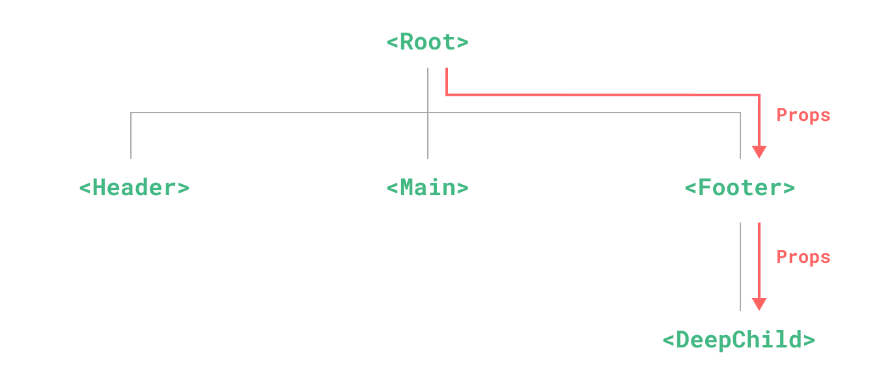

# Provide(제공) / Inject(주입)

> 이 페이지에서는 [컴포넌트 기초](/guide/essentials/component-basics)를 이미 읽었다고 가정합니다.
컴포넌트를 처음 사용하는 경우, 그 문서를 먼저 읽으십시오.

## Prop 드릴링

일반적으로 상위 컴포넌트에서 하위 컴포넌트로 데이터를 전달해야 할 때 [props](/guide/components/props)를 사용합니다.
그러나 큰 컴포넌트 트리가 있고 깊이 중첩된 컴포넌트에 먼 조상 컴포넌트의 무언가가 필요한 경우를 상상해 보십시오.
props만 있으면 전체 부모 체인에 동일한 prop을 전달해야 합니다:



<!-- https://www.figma.com/file/yNDTtReM2xVgjcGVRzChss/prop-drilling -->

`<Footer>` 컴포넌트는 이 prop가 전혀 필요하지 않을 수 있지만, `<DeepChild>`가 접근할 수 있도록 여전히 선언하고 전달해야 합니다.
더 긴 상위 체인이 있으면 그 과정에서 더 많은 컴포넌트가 영향을 받습니다.
이것을 "prop 드릴링"이라고 하며 정말 재미가 없습니다.

우리는 `provide`와 `inject`로 props 드릴링을 해결할 수 있습니다.
상위 컴포넌트는 모든 하위 컴포넌트에 대한 **종속성 제공자** 역할을 할 수 있습니다.
하위 트리의 모든 컴포넌트는 깊이에 관계없이 상위 체인의 컴포넌트에서 제공(provide)하는 종속성을 **주입**(inject)할 수 있습니다.


<!-- https://www.figma.com/file/PbTJ9oXis5KUawEOWdy2cE/provide-inject -->
<!-- https://www.figma.com/file/t9jXISrv0ZJyq5WNOa79fH/provide%2Finject-(ko-kr) -->

## Provide

<div class="composition-api">

컴포넌트의 하위 항목에 데이터를 제공하려면 [`provide()`](/api/composition-api-dependency-injection.html#provide) 함수를 사용하세요:

```vue
<script setup>
import { provide } from 'vue'

provide(/* 키 */ 'message', /* 값 */ '안녕!')
</script>
```

`<script setup>`을 사용하지 않는 경우 `setup()` 내부에서 `provide()`가 동기적으로 호출되는지 확인해야 합니다:

```js
import { provide } from 'vue'

export default {
  setup() {
    provide(/* 키 */ 'message', /* 값 */ '안녕!')
  }
}
```

`provide()` 함수는 두 개의 인자를 허용합니다.
첫 번째 인자는 **주입 키**라고 하며 문자열 또는 `Symbol`이 될 수 있습니다.
주입 키는 하위 컴포넌트에서 주입할 원하는 값을 조회하는 데 사용됩니다.
단일 컴포넌트는 다른 값을 제공하기 위해 다른 주입 키를 사용하여 `provide()`를 여러 번 호출할 수 있습니다.

두 번째 인자는 제공되는 값입니다.
값은 refs와 같은 반응 상태를 포함하여 모든 유형이 될 수 있습니다:

```js
import { ref, provide } from 'vue'

const count = ref(0)
provide('key', count)
```

반응형 값을 제공하면, 제공된 값을 사용하는 하위 컴포넌트가 제공자 컴포넌트에 대한 반응형 연결을 설정할 수 있습니다.

</div>

<div class="options-api">

컴포넌트의 하위 항목에 데이터를 제공하려면 [`provide`](/api/options-composition.html#provide) 옵션을 사용하세요:

```js
export default {
  provide: {
    message: '안녕!'
  }
}
```

`provide` 객체의 각 속성에 대해 키는 주입한 값을 올바르게 찾기 위해 사용되고, 값은 주입된 것입니다.

예를 들어 `data()`를 통해 선언된 데이터와 같이 인스턴스별 상태를 제공해야 하는 경우, `provide`는 함수 값을 사용해야 합니다:

```js{7-12}
export default {
  data() {
    return {
      message: '안녕!'
    }
  },
  provide() {
    // 함수 구문을 사용하여 `this`에 액세스할 수 있습니다.
    return {
      message: this.message
    }
  }
}
```

그러나 이것이 주입된 값을 반응형으로 만들지 **않습니다**.
우리는 아래에서 주입된 값을 [반응형으로 만들기](#반응형으로-만들기)에 대해 논의할 것입니다.

</div>

## 앱 수준의 provide

컴포넌트에 데이터를 제공하는 것 외에도 앱 수준에서 다음을 제공할 수도 있습니다:

```js
import { createApp } from 'vue'

const app = createApp({})

app.provide(/* 키 */ 'message', /* 값 */ '안녕!')
```

앱 수준 제공은 앱에서 렌더링되는 모든 컴포넌트에서 사용할 수 있습니다.
플러그인은 일반적으로 컴포넌트를 사용하여 값을 제공할 수 없기 때문에 [플러그인](/guide/reusability/plugins.html)을 작성할 때 특히 유용합니다.

## Inject

<div class="composition-api">

상위 컴포넌트에서 제공하는 데이터를 주입하려면 [`inject()`](/api/composition-api-dependency-injection.html#inject) 함수를 사용하세요:

```vue
<script setup>
import { inject } from 'vue'

const message = inject('message')
</script>
```

제공된 값이 ref인 경우, 그대로 주입되고 자동으로 래핑 해제되지 **않습니다**.
이를 통해 주입 대상 컴포넌트는 제공자 컴포넌트에 대한 반응성 연결을 유지할 수 있습니다.

[반응형으로 작동하는 provide 및 inject의 전체 예제 보기](https://sfc.vuejs.org/#eyJBcHAudnVlIjoiPHNjcmlwdCBzZXR1cD5cbmltcG9ydCB7IHJlZiwgcHJvdmlkZSB9IGZyb20gJ3Z1ZSdcbmltcG9ydCBDaGlsZCBmcm9tICcuL0NoaWxkLnZ1ZSdcblxuLy8gcmVm66W8IOygnOqzte2VqOycvOuhnOyNqCBHcmFuZENoaWxk64qUXG4vLyDsl6zquLDshJwg7J287Ja064KY64qUIOuzgO2ZlOyXkCDrsJjsnZHtlaAg7IiYIOyeiOyKteuLiOuLpC5cbmNvbnN0IG1lc3NhZ2UgPSByZWYoJ+yViOuFlScpXG5wcm92aWRlKCdtZXNzYWdlJywgbWVzc2FnZSlcbjwvc2NyaXB0PlxuXG48dGVtcGxhdGU+XG4gIDxpbnB1dCB2LW1vZGVsPVwibWVzc2FnZVwiPlxuICA8Q2hpbGQgLz5cbjwvdGVtcGxhdGU+IiwiaW1wb3J0LW1hcC5qc29uIjoie1xuICBcImltcG9ydHNcIjoge1xuICAgIFwidnVlXCI6IFwiaHR0cHM6Ly9zZmMudnVlanMub3JnL3Z1ZS5ydW50aW1lLmVzbS1icm93c2VyLmpzXCIsXG4gICAgXCJ2dWUvc2VydmVyLXJlbmRlcmVyXCI6IFwiaHR0cHM6Ly9zZmMudnVlanMub3JnL3NlcnZlci1yZW5kZXJlci5lc20tYnJvd3Nlci5qc1wiXG4gIH1cbn0iLCJDaGlsZC52dWUiOiI8c2NyaXB0IHNldHVwPlxuaW1wb3J0IEdyYW5kQ2hpbGQgZnJvbSAnLi9HcmFuZENoaWxkLnZ1ZSdcbjwvc2NyaXB0PlxuXG48dGVtcGxhdGU+XG4gIDxHcmFuZENoaWxkIC8+XG48L3RlbXBsYXRlPiIsIkdyYW5kQ2hpbGQudnVlIjoiPHNjcmlwdCBzZXR1cD5cbmltcG9ydCB7IGluamVjdCB9IGZyb20gJ3Z1ZSdcblxuY29uc3QgbWVzc2FnZSA9IGluamVjdCgnbWVzc2FnZScpXG48L3NjcmlwdD5cblxuPHRlbXBsYXRlPlxuICA8cD5cbiAgICDshpDsnpDsl5Dqsowg7KCE7ZWY64qUIOuplOyLnOyngDoge3sgbWVzc2FnZSB9fVxuICA8L3A+XG48L3RlbXBsYXRlPiJ9)

주의해야 할 것은 `<script setup>`을 사용하지 않는 경우, `inject()`는 `setup()` 내에서 동기적으로만 호출되어야 합니다:

```js
import { inject } from 'vue'

export default {
  setup() {
    const message = inject('message')
    return { message }
  }
}
```

</div>

<div class="options-api">

상위 컴포넌트에서 제공하는 데이터를 주입하려면 [`inject`](/api/options-composition.html#inject) 옵션을 사용하세요:

```js
export default {
  inject: ['message'],
  created() {
    console.log(this.message) // 주입된 값
  }
}
```

`inject`는 컴포넌트 자체 상태보다 먼저 구성되므로, `data()`에서 주입된 속성에 접근할 수 있습니다:

```js
export default {
  inject: ['message'],
  data() {
    return {
      // 주입된 값을 기반으로 하는 초기 데이터
      fullMessage: this.message
    }
  }
}
```

[반응형으로 작동하는 provide 및 inject의 전체 예제 보기](https://sfc.vuejs.org/#eyJBcHAudnVlIjoiPHNjcmlwdD5cbmltcG9ydCBDaGlsZCBmcm9tICcuL0NoaWxkLnZ1ZSdcblxuZXhwb3J0IGRlZmF1bHQge1xuICBjb21wb25lbnRzOiB7IENoaWxkIH0sXG4gIHByb3ZpZGUoKSB7XG4gICAgcmV0dXJuIHtcbiAgICAgIG1lc3NhZ2U6ICfslYjrhZUnXG4gICAgfVxuICB9XG59XG48L3NjcmlwdD5cblxuPHRlbXBsYXRlPlxuICA8Q2hpbGQgLz5cbjwvdGVtcGxhdGU+IiwiaW1wb3J0LW1hcC5qc29uIjoie1xuICBcImltcG9ydHNcIjoge1xuICAgIFwidnVlXCI6IFwiaHR0cHM6Ly9zZmMudnVlanMub3JnL3Z1ZS5ydW50aW1lLmVzbS1icm93c2VyLmpzXCIsXG4gICAgXCJ2dWUvc2VydmVyLXJlbmRlcmVyXCI6IFwiaHR0cHM6Ly9zZmMudnVlanMub3JnL3NlcnZlci1yZW5kZXJlci5lc20tYnJvd3Nlci5qc1wiXG4gIH1cbn0iLCJDaGlsZC52dWUiOiI8c2NyaXB0PlxuaW1wb3J0IEdyYW5kQ2hpbGQgZnJvbSAnLi9HcmFuZENoaWxkLnZ1ZSdcblxuZXhwb3J0IGRlZmF1bHQge1xuICBjb21wb25lbnRzOiB7XG4gICAgR3JhbmRDaGlsZFxuICB9XG59XG48L3NjcmlwdD5cblxuPHRlbXBsYXRlPlxuICA8R3JhbmRDaGlsZCAvPlxuPC90ZW1wbGF0ZT4iLCJHcmFuZENoaWxkLnZ1ZSI6IjxzY3JpcHQ+XG5leHBvcnQgZGVmYXVsdCB7XG4gIGluamVjdDogWydtZXNzYWdlJ11cbn1cbjwvc2NyaXB0PlxuXG48dGVtcGxhdGU+XG4gIDxwPlxuICAgIOyGkOyekOyXkOqyjCDsoITtlZjripQg66mU7Iuc7KeAOiB7eyBtZXNzYWdlIH19XG4gIDwvcD5cbjwvdGVtcGxhdGU+In0=)

### 주입 별칭 \*

`inject`에 대한 배열 구문을 사용할 때 주입된 속성은 동일한 키를 사용하여 컴포넌트 인스턴스에 노출됩니다.
위의 예제에서 속성은 `"message"` 키 아래에 제공되었으며 `this.message`로 삽입되었습니다.
로컬 키는 주입 키와 동일합니다.

다른 로컬 키를 사용하여 속성을 주입하려면 `inject` 옵션에 객체 구문을 사용해야 합니다:

```js
export default {
  inject: {
    /* 로컬 키 */ localMessage: {
      from: /* 주입된 키 */ 'message'
    }
  }
}
```

여기서 컴포넌트는 `"message"` 키와 함께 제공된 속성을 찾은 다음 `this.localMessage`로 노출합니다.

</div>

### 주입 시 기본 값 설정하기

기본적으로 `inject`는 주입된 키가 상위 체인의 어딘가에서 제공된다고 가정합니다.
키가 제공되지 않은 경우 런타임 경고가 표시됩니다.

제공자가 필수적으로 값을 제공하지 않는 환경에서 주입된 속성이 작동하도록 하려면 props처럼 기본값을 선언해야 합니다:

<div class="composition-api">

```js
// "message"와 일치하는 데이터가 제공되지 않은 경우
// `value`의 기본 값은 "이것은 기본 값 문자열 입니다."가 됩니다.
const value = inject('message', '이것은 기본 값 문자열 입니다.')
```

경우에 따라 함수를 호출하거나 새 클래스를 인스턴스화하여 기본값을 만들어야 할 수도 있습니다.
값이 제공되지 않는 경우, 불필요한 계산이나 사이드 이펙트를 피하기 위해 기본값을 생성하는 팩토리 함수를 사용할 수 있습니다:

```js
const value = inject('key', () => new ExpensiveClass())
```

</div>

<div class="options-api">

```js
export default {
  // 주입에 대한 기본값을 선언할 때
  // 객체 구문이 필요합니다.
  inject: {
    message: {
      from: 'message', // 주입 시 키와 같은 이름을 사용하는 경우 선택사항입니다.
      default: '이것은 기본 값 문자열 입니다.'
    },
    user: {
      // 생성하는 데 비용이 많이 드는 기본이 아닌 값 또는 컴포넌트 인스턴스마다
      // 고유해야 하는 값에 대해 팩토리 함수를 사용합니다.
      default: () => ({ name: '철수' })
    }
  }
}
```

</div>

## 반응형으로 만들기

<div class="composition-api">

반응형 제공/주입 값을 사용할 때, 가능하면 제공자 내부에서 모든 변경사항을 반응성 상태로 유지하는 것이 좋습니다.
이렇게 하면 제공된 상태와 가능한 변화가 동일한 컴포넌트에 함께 배치되어 향후 유지 관리가 더 쉬워집니다.

주입 대상 컴포넌트에서 데이터를 업데이트해야 하는 경우가 있습니다.
이러한 경우 상태 변경을 담당하는 함수를 제공하는 것이 좋습니다:

```vue{7-9,13}
<!-- 제공자 컴포넌트 내부 -->
<script setup>
import { provide, ref } from 'vue'

const location = ref('북극')

function updateLocation() {
  location.value = '남극'
}

provide('location', {
  location,
  updateLocation
})
</script>
```

```vue{5}
<!-- 주입되는 컴포는트 내부 -->
<script setup>
import { inject } from 'vue'

const { location, updateLocation } = inject('location')
</script>

<template>
  <button @click="updateLocation">{{ location }}</button>
</template>
```

마지막으로, `provide`를 통해 전달된 데이터가 주입된 컴포넌트에 의해 변경될 수 없도록 하려면,
제공된 값을 [`readonly()`](/api/reactivity-core.html#readonly)로 래핑할 수 있습니다.

```vue
<script setup>
import { ref, provide, readonly } from 'vue'

const count = ref(0)
provide('read-only-count', readonly(count))
</script>
```

</div>

<div class="options-api">

제공자로부터 반응형으로 연결된 주입을 만들기 위해,
[computed()](/api/reactivity-core.html#computed) 함수를 사용하여 계산된 속성을 제공해야 합니다:

```js{10}
import { computed } from 'vue'

export default {
  data() {
    return {
      message: '안녕!'
    }
  },
  provide() {
    return {
      // 계산된 속성을 명시적으로 제공
      message: computed(() => this.message)
    }
  }
}
```

[반응형으로 작동하는 provide 및 inject의 전체 예제 보기](https://sfc.vuejs.org/#eyJBcHAudnVlIjoiPHNjcmlwdD5cbmltcG9ydCBDaGlsZCBmcm9tICcuL0NoaWxkLnZ1ZSdcbmltcG9ydCB7IGNvbXB1dGVkIH0gZnJvbSAndnVlJ1xuXG5leHBvcnQgZGVmYXVsdCB7XG4gIGNvbXBvbmVudHM6IHsgQ2hpbGQgfSxcbiAgZGF0YSgpIHtcbiAgICByZXR1cm4ge1xuICAgICAgbWVzc2FnZTogJ+yViOuFlSdcbiAgICB9XG4gIH0sXG4gIHByb3ZpZGUoKSB7XG4gICAgcmV0dXJuIHtcbiAgICAgIG1lc3NhZ2U6IGNvbXB1dGVkKCgpID0+IHRoaXMubWVzc2FnZSlcbiAgICB9XG4gIH1cbn1cbjwvc2NyaXB0PlxuXG48dGVtcGxhdGU+XG4gIDxpbnB1dCB2LW1vZGVsPVwibWVzc2FnZVwiPlxuICA8Q2hpbGQgLz5cbjwvdGVtcGxhdGU+IiwiaW1wb3J0LW1hcC5qc29uIjoie1xuICBcImltcG9ydHNcIjoge1xuICAgIFwidnVlXCI6IFwiaHR0cHM6Ly9zZmMudnVlanMub3JnL3Z1ZS5ydW50aW1lLmVzbS1icm93c2VyLmpzXCIsXG4gICAgXCJ2dWUvc2VydmVyLXJlbmRlcmVyXCI6IFwiaHR0cHM6Ly9zZmMudnVlanMub3JnL3NlcnZlci1yZW5kZXJlci5lc20tYnJvd3Nlci5qc1wiXG4gIH1cbn0iLCJDaGlsZC52dWUiOiI8c2NyaXB0PlxuaW1wb3J0IEdyYW5kQ2hpbGQgZnJvbSAnLi9HcmFuZENoaWxkLnZ1ZSdcblxuZXhwb3J0IGRlZmF1bHQge1xuICBjb21wb25lbnRzOiB7XG4gICAgR3JhbmRDaGlsZFxuICB9XG59XG48L3NjcmlwdD5cblxuPHRlbXBsYXRlPlxuICA8R3JhbmRDaGlsZCAvPlxuPC90ZW1wbGF0ZT4iLCJHcmFuZENoaWxkLnZ1ZSI6IjxzY3JpcHQ+XG5leHBvcnQgZGVmYXVsdCB7XG4gIGluamVjdDogWydtZXNzYWdlJ11cbn1cbjwvc2NyaXB0PlxuXG48dGVtcGxhdGU+XG4gIDxwPlxuICAgIOyGkOyekOyXkOqyjCDsoITtlZjripQg66mU7Iuc7KeAOiB7eyBtZXNzYWdlIH19XG4gIDwvcD5cbjwvdGVtcGxhdGU+In0=)

`computed()` 함수는 일반적으로 컴포지션 API 컴포넌트에서 사용되지만 옵션 API의 특정 사용 사례를 보완하는 데 사용할 수도 있습니다.
API 스타일 설정이 Composition API로 지정된 상태에서 [반응형 기초](/guide/essentials/reactivity-fundamentals.html) 및 [계산된 속성](/guide/essentials/computed.html) 가이드 문서를 읽으면 사용법에 대해 자세히 알아볼 수 있습니다.

:::warning 환경 설정이 필요함
위의 사용법은 주입되는 곳에서 계산된 refs를 자동으로 해제하기 위해 `app.config.unwrapInjectedRef = true`를 설정해야 합니다.
이것은 Vue 3.3에서 기본 적용 값 이며, 이 환경 설정은 하위에서 상위 데이터를 변조시키는 동작을 피하기 위해 도입됩니다.
3.3 버전 이상에서는 더 이상 필요하지 않습니다.
:::

</div>

## 심볼 키 사용하기

지금까지 예제에서 문자열 삽입 키를 사용했습니다.
많은 종속성 제공자가 있는 대규모 앱에서 작업하거나,
다른 개발자가 사용할 컴포넌트를 작성하는 경우,
잠재적 충돌을 피하기 위해 제공 키로 `Symbol`(심볼)을 사용하는 것이 가장 좋습니다.

심볼을 전용 파일로 내보내는 것이 좋습니다.:

```js
// keys.js
export const myInjectionKey = Symbol()
```

<div class="composition-api">

```js
// 제공하는 곳의 컴포넌트에서
import { provide } from 'vue'
import { myInjectionKey } from './keys.js'

provide(myInjectionKey, {
  /* 제공할 데이터 */
})
```

```js
// 주입되는 곳의 컴포넌트에서
import { inject } from 'vue'
import { myInjectionKey } from './keys.js'

const injected = inject(myInjectionKey)
```

참조: [Provide / Inject 타입 지정하기](/guide/typescript/composition-api.html#typing-provide-inject) <sup class="vt-badge ts" />

</div>

<div class="options-api">

```js
// 제공하는 곳의 컴포넌트에서
import { myInjectionKey } from './keys.js'

export default {
  provide() {
    return {
      [myInjectionKey]: {
        /* 제공할 데이터 */
      }
    }
  }
}
```

```js
// 주입되는 곳의 컴포넌트에서
import { myInjectionKey } from './keys.js'

export default {
  inject: {
    injected: { from: myInjectionKey }
  }
}
```

</div>
