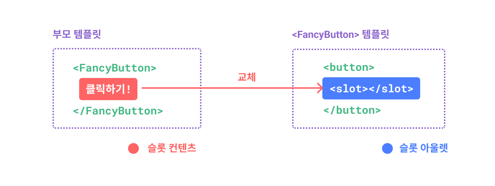
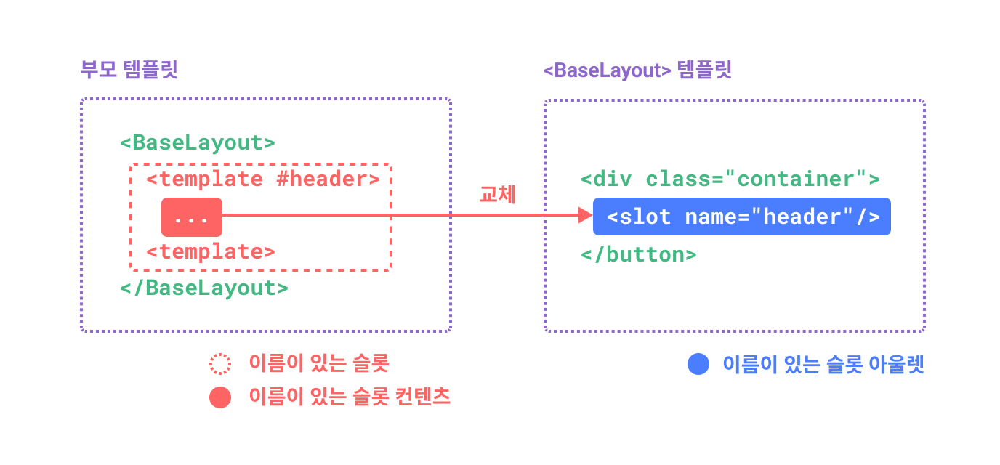
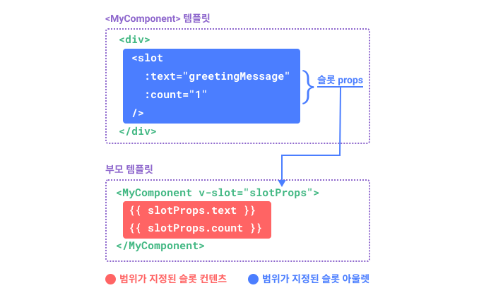

# 슬롯

> 이 페이지에서는 [컴포넌트 기초](/guide/essentials/component-basics)를 이미 읽었다고 가정합니다.
컴포넌트를 처음 사용하는 경우, 그 문서를 먼저 읽으십시오.

## 슬롯 컨텐츠와 아울렛

우리는 컴포넌트의 props가 모든 유형의 JavaScript 값을 받을 수 있다는 것을 배웠습니다.
그러나 템플릿 컨텐츠는 어떻습니까?
어떤 경우에는 템플릿 조각을 자식 컴포넌트에 전달하고 자식 컴포넌트가 자체 템플릿 내에서 조각을 렌더링하도록 할 수 있습니다.

예를 들어 다음과 같은 사용법을 지원하는 `<FancyButton>` 컴포넌트가 있을 수 있습니다:

```vue-html{2}
<FancyButton>
  클릭하기! <!-- 슬롯 컨텐츠 -->
</FancyButton>
```

`<FancyButton>`의 템플릿은 다음과 같습니다:

```vue-html{2}
<button class="fancy-btn">
  <slot></slot> <!-- 슬롯 아울렛 -->
</button>
```

`<slot>` 엘리먼트는 부모가 제공한 **슬롯 컨텐츠**가 렌더링되어야 하는 위치를 나타내는 **슬롯 아울렛**(outlet)입니다.



<!-- https://www.figma.com/file/LjKTYVL97Ck6TEmBbstavX/slot -->
<!-- https://www.figma.com/file/PuKXOMrFPmfnrtMa3tKL5G/slot-(ko-kr) -->

최종적으로 렌더링된 DOM은:

```html
<button class="fancy-btn">
  클릭하기!
</button>
```

<div class="composition-api">

[온라인 연습장으로 실행하기](https://sfc.vuejs.org/#eyJBcHAudnVlIjoiPHNjcmlwdCBzZXR1cD5cbmltcG9ydCBGYW5jeUJ1dHRvbiBmcm9tICcuL0ZhbmN5QnV0dG9uLnZ1ZSdcbjwvc2NyaXB0PlxuXG48dGVtcGxhdGU+XG4gIDxGYW5jeUJ1dHRvbj5cbiAgICDtgbTrpq3tlZjquLAgPCEtLSDsiqzroa8g7Luo7YWQ7LigIC0tPlxuIFx0PC9GYW5jeUJ1dHRvbj5cbjwvdGVtcGxhdGU+IiwiaW1wb3J0LW1hcC5qc29uIjoie1xuICBcImltcG9ydHNcIjoge1xuICAgIFwidnVlXCI6IFwiaHR0cHM6Ly9zZmMudnVlanMub3JnL3Z1ZS5ydW50aW1lLmVzbS1icm93c2VyLmpzXCIsXG4gICAgXCJ2dWUvc2VydmVyLXJlbmRlcmVyXCI6IFwiaHR0cHM6Ly9zZmMudnVlanMub3JnL3NlcnZlci1yZW5kZXJlci5lc20tYnJvd3Nlci5qc1wiXG4gIH1cbn0iLCJGYW5jeUJ1dHRvbi52dWUiOiI8dGVtcGxhdGU+XG4gIDxidXR0b24gY2xhc3M9XCJmYW5jeS1idG5cIj5cbiAgXHQ8c2xvdC8+IDwhLS0g7Iqs66GvIOyVhOyauOugmyAtLT5cblx0PC9idXR0b24+XG48L3RlbXBsYXRlPlxuXG48c3R5bGU+XG4uZmFuY3ktYnRuIHtcbiAgY29sb3I6ICNmZmY7XG4gIGJhY2tncm91bmQ6IGxpbmVhci1ncmFkaWVudCgzMTVkZWcsICM0MmQzOTIgMjUlLCAjNjQ3ZWZmKTtcbiAgYm9yZGVyOiBub25lO1xuICBwYWRkaW5nOiA1cHggMTBweDtcbiAgbWFyZ2luOiA1cHg7XG4gIGJvcmRlci1yYWRpdXM6IDhweDtcbiAgY3Vyc29yOiBwb2ludGVyO1xufVxuPC9zdHlsZT4ifQ==)

</div>
<div class="options-api">

[온라인 연습장으로 실행하기](https://sfc.vuejs.org/#eyJBcHAudnVlIjoiPHNjcmlwdD5cbmltcG9ydCBGYW5jeUJ1dHRvbiBmcm9tICcuL0ZhbmN5QnV0dG9uLnZ1ZSdcbiAgXG5leHBvcnQgZGVmYXVsdCB7XG4gIGNvbXBvbmVudHM6IHsgRmFuY3lCdXR0b24gfVxufVxuPC9zY3JpcHQ+XG5cbjx0ZW1wbGF0ZT5cbiAgPEZhbmN5QnV0dG9uPlxuICAgIO2BtOumre2VmOq4sCA8IS0tIOyKrOuhryDsu6jthZDsuKAgLS0+XG4gXHQ8L0ZhbmN5QnV0dG9uPlxuPC90ZW1wbGF0ZT4iLCJpbXBvcnQtbWFwLmpzb24iOiJ7XG4gIFwiaW1wb3J0c1wiOiB7XG4gICAgXCJ2dWVcIjogXCJodHRwczovL3NmYy52dWVqcy5vcmcvdnVlLnJ1bnRpbWUuZXNtLWJyb3dzZXIuanNcIixcbiAgICBcInZ1ZS9zZXJ2ZXItcmVuZGVyZXJcIjogXCJodHRwczovL3NmYy52dWVqcy5vcmcvc2VydmVyLXJlbmRlcmVyLmVzbS1icm93c2VyLmpzXCJcbiAgfVxufSIsIkZhbmN5QnV0dG9uLnZ1ZSI6Ijx0ZW1wbGF0ZT5cbiAgPGJ1dHRvbiBjbGFzcz1cImZhbmN5LWJ0blwiPlxuICBcdDxzbG90Lz4gPCEtLSDsiqzroa8g7JWE7Jq466CbIC0tPlxuXHQ8L2J1dHRvbj5cbjwvdGVtcGxhdGU+XG5cbjxzdHlsZT5cbi5mYW5jeS1idG4ge1xuICBjb2xvcjogI2ZmZjtcbiAgYmFja2dyb3VuZDogbGluZWFyLWdyYWRpZW50KDMxNWRlZywgIzQyZDM5MiAyNSUsICM2NDdlZmYpO1xuICBib3JkZXI6IG5vbmU7XG4gIHBhZGRpbmc6IDVweCAxMHB4O1xuICBtYXJnaW46IDVweDtcbiAgYm9yZGVyLXJhZGl1czogOHB4O1xuICBjdXJzb3I6IHBvaW50ZXI7XG59XG48L3N0eWxlPiJ9)

</div>

슬롯을 사용 시, `<FancyButton>`이 `<button>`(및 멋진 스타일 지정)을 렌더링하고, 내부 컨텐츠를 하위 컴포넌트에게 제공합니다.

슬롯을 이해하는 또 다른 방법은 슬롯을 JavaScript 함수와 비교하는 것입니다:

```js
// 슬롯 컨텐츠를 전달하는 상위 컴포넌트
FancyButton('클릭하기!')

// FancyButton은 자체 템플릿에서 슬롯 컨텐츠를 렌더링합니다.
function FancyButton(slotContent) {
  return (
    `<button class="fancy-btn">
      ${slotContent}
    </button>`
  )
}
```

슬롯 컨텐츠는 텍스트에만 국한되지 않습니다.
모든 유효한 템플릿 컨텐츠일 수 있습니다.
예를 들어 여러 엘리먼트 또는 다른 컴포넌트를 전달할 수 있습니다:

```vue-html
<FancyButton>
  <span style="color:red">클릭하기!</span>
  <AwesomeIcon name="plus" />
</FancyButton>
```

<div class="composition-api">

[온라인 연습장으로 실행하기](https://sfc.vuejs.org/#eyJBcHAudnVlIjoiPHNjcmlwdCBzZXR1cD5cbmltcG9ydCBGYW5jeUJ1dHRvbiBmcm9tICcuL0ZhbmN5QnV0dG9uLnZ1ZSdcbmltcG9ydCBBd2Vzb21lSWNvbiBmcm9tICcuL0F3ZXNvbWVJY29uLnZ1ZSdcbjwvc2NyaXB0PlxuXG48dGVtcGxhdGU+XG4gIDxGYW5jeUJ1dHRvbj5cbiAgICDtgbTrpq3tlZjquLAhXG4gXHQ8L0ZhbmN5QnV0dG9uPlxuICA8RmFuY3lCdXR0b24+XG4gICAgPHNwYW4gc3R5bGU9XCJjb2xvcjpjeWFuXCI+7YG066at7ZWY6riwITwvc3Bhbj5cbiAgICA8QXdlc29tZUljb24gLz5cbiAgPC9GYW5jeUJ1dHRvbj5cbjwvdGVtcGxhdGU+IiwiaW1wb3J0LW1hcC5qc29uIjoie1xuICBcImltcG9ydHNcIjoge1xuICAgIFwidnVlXCI6IFwiaHR0cHM6Ly9zZmMudnVlanMub3JnL3Z1ZS5ydW50aW1lLmVzbS1icm93c2VyLmpzXCIsXG4gICAgXCJ2dWUvc2VydmVyLXJlbmRlcmVyXCI6IFwiaHR0cHM6Ly9zZmMudnVlanMub3JnL3NlcnZlci1yZW5kZXJlci5lc20tYnJvd3Nlci5qc1wiXG4gIH1cbn0iLCJGYW5jeUJ1dHRvbi52dWUiOiI8dGVtcGxhdGU+XG4gIDxidXR0b24gY2xhc3M9XCJmYW5jeS1idG5cIj5cbiAgXHQ8c2xvdC8+XG5cdDwvYnV0dG9uPlxuPC90ZW1wbGF0ZT5cblxuPHN0eWxlPlxuLmZhbmN5LWJ0biB7XG4gIGNvbG9yOiAjZmZmO1xuICBiYWNrZ3JvdW5kOiBsaW5lYXItZ3JhZGllbnQoMzE1ZGVnLCAjNDJkMzkyIDI1JSwgIzY0N2VmZik7XG4gIGJvcmRlcjogbm9uZTtcbiAgcGFkZGluZzogNXB4IDEwcHg7XG4gIG1hcmdpbjogNXB4O1xuICBib3JkZXItcmFkaXVzOiA4cHg7XG4gIGN1cnNvcjogcG9pbnRlcjtcbn1cbjwvc3R5bGU+IiwiQXdlc29tZUljb24udnVlIjoiPCEtLSDrjbDrqqgg66qp7KCB7Jy866GcIOydtOuqqO2LsOy9mCDsgqzsmqkgLS0+XG48dGVtcGxhdGU+4p2k77iPPC90ZW1wbGF0ZT4ifQ==)

</div>
<div class="options-api">

[온라인 연습장으로 실행하기](https://sfc.vuejs.org/#eyJBcHAudnVlIjoiPHNjcmlwdD5cbmltcG9ydCBGYW5jeUJ1dHRvbiBmcm9tICcuL0ZhbmN5QnV0dG9uLnZ1ZSdcbmltcG9ydCBBd2Vzb21lSWNvbiBmcm9tICcuL0F3ZXNvbWVJY29uLnZ1ZSdcbiAgXG5leHBvcnQgZGVmYXVsdCB7XG4gIGNvbXBvbmVudHM6IHsgRmFuY3lCdXR0b24sIEF3ZXNvbWVJY29uIH1cbn1cbjwvc2NyaXB0PlxuXG48dGVtcGxhdGU+XG4gIDxGYW5jeUJ1dHRvbj5cbiAgICDtgbTrpq3tlZjquLBcbiBcdDwvRmFuY3lCdXR0b24+XG5cbiAgPEZhbmN5QnV0dG9uPlxuICAgIDxzcGFuIHN0eWxlPVwiY29sb3I6Y3lhblwiPu2BtOumre2VmOq4sCE8L3NwYW4+XG4gICAgPEF3ZXNvbWVJY29uIC8+XG4gIDwvRmFuY3lCdXR0b24+XG48L3RlbXBsYXRlPiIsImltcG9ydC1tYXAuanNvbiI6IntcbiAgXCJpbXBvcnRzXCI6IHtcbiAgICBcInZ1ZVwiOiBcImh0dHBzOi8vc2ZjLnZ1ZWpzLm9yZy92dWUucnVudGltZS5lc20tYnJvd3Nlci5qc1wiLFxuICAgIFwidnVlL3NlcnZlci1yZW5kZXJlclwiOiBcImh0dHBzOi8vc2ZjLnZ1ZWpzLm9yZy9zZXJ2ZXItcmVuZGVyZXIuZXNtLWJyb3dzZXIuanNcIlxuICB9XG59IiwiRmFuY3lCdXR0b24udnVlIjoiPHRlbXBsYXRlPlxuICA8YnV0dG9uIGNsYXNzPVwiZmFuY3ktYnRuXCI+XG4gIFx0PHNsb3QvPlxuXHQ8L2J1dHRvbj5cbjwvdGVtcGxhdGU+XG5cbjxzdHlsZT5cbi5mYW5jeS1idG4ge1xuICBjb2xvcjogI2ZmZjtcbiAgYmFja2dyb3VuZDogbGluZWFyLWdyYWRpZW50KDMxNWRlZywgIzQyZDM5MiAyNSUsICM2NDdlZmYpO1xuICBib3JkZXI6IG5vbmU7XG4gIHBhZGRpbmc6IDVweCAxMHB4O1xuICBtYXJnaW46IDVweDtcbiAgYm9yZGVyLXJhZGl1czogOHB4O1xuICBjdXJzb3I6IHBvaW50ZXI7XG59XG48L3N0eWxlPiIsIkF3ZXNvbWVJY29uLnZ1ZSI6IjwhLS0g642w66qoIOuqqeyggeycvOuhnCDsnbTrqqjti7DsvZgg7IKs7JqpIC0tPlxuPHRlbXBsYXRlPuKdpO+4jzwvdGVtcGxhdGU+In0=)

</div>

슬롯을 사용하면 `<FancyButton>`이 더 유연하고 재사용 가능하게 할 수 있습니다.
이제 내부 내용은 다르지만 모두 동일한 멋진 스타일로 다른 장소에서 사용할 수 있습니다.

Vue 컴포넌트의 슬롯 메커니즘은 [네이티브 웹 컴포넌트 `<slot>` 엘리먼트](https://developer.mozilla.org/en-US/docs/Web/HTML/Element/slot)에서 영감을 얻었고, 나중에 추가 기능에 대해 설명하겠습니다.

## 렌더링 범위

슬롯 컨텐츠는 상위 컴포넌트에 정의되어 있으므로 상위 컴포넌트의 데이터 범위에 액세스할 수 있습니다.
예를 들어:

```vue-html
<span>{{ message }}</span>
<FancyButton>{{ message }}</FancyButton>
```

여기서 두 <span v-pre>`{{ message }}`</span> 이중 중괄호 문법은 동일한 컨텐츠를 렌더링합니다.

슬롯 컨텐츠는 하위 컴포넌트의 데이터에 접근할 수 **없습니다**.
일반적으로 다음을 기억하십시오:

> 상위 템플릿의 모든 항목은 상위 범위에서 컴파일됩니다. 자식 템플릿의 모든 것은 자식 범위에서 컴파일됩니다.

## 대체 컨텐츠

슬롯에 대체(fallback) 컨텐츠를 지정하여, 컨텐츠가 제공되지 않을 때만 렌더링되도록 하는 것이 유용한 경우가 있습니다.
예를 들어 `<SubmitButton>` 컴포넌트에서:

```vue-html
<button type="submit">
  <slot></slot>
</button>
```

부모가 슬롯 컨텐츠를 제공하지 않은 경우, "제출" 텍스트가 `<button>` 내부에 렌더링되기를 원할 수 있습니다.
"제출"을 대체 컨텐츠로 지정하려면 `<slot>` 태그 사이에 배치하면 됩니다:

```vue-html{3}
<button type="submit">
  <slot>
    제출 <!-- 대체 컨텐츠 -->
  </slot>
</button>
```

이제 상위 컴포넌트 `<SubmitButton>`을 사용하여 슬롯에 컨텐츠를 제공하지 않습니다:

```vue-html
<SubmitButton />
```

그러면 대체 컨텐츠로 "제출"이 렌더링됩니다:

```html
<button type="submit">제출</button>
```

그러나 컨텐츠를 제공하는 경우:

```vue-html
<SubmitButton>저장</SubmitButton>
```

제공된 컨텐츠가 대신 렌더링됩니다:

```html
<button type="submit">저장</button>
```

<div class="composition-api">

[온라인 연습장으로 실행하기](https://sfc.vuejs.org/#eyJBcHAudnVlIjoiPHNjcmlwdCBzZXR1cD5cbmltcG9ydCBTdWJtaXRCdXR0b24gZnJvbSAnLi9TdWJtaXRCdXR0b24udnVlJ1xuPC9zY3JpcHQ+XG5cbjx0ZW1wbGF0ZT5cbiAgPCEtLSDrjIDssrQg7YWN7Iqk7Yq4IOyCrOyaqSAtLT5cbiAgPFN1Ym1pdEJ1dHRvbiAvPlxuICBcbiAgPCEtLSDsgqzsmqnsnpAg7KCV7J2YIO2FjeyKpO2KuCDsoJzqs7UgLS0+XG4gIDxTdWJtaXRCdXR0b24+7KCA7J6lPC9TdWJtaXRCdXR0b24+XG48L3RlbXBsYXRlPiIsImltcG9ydC1tYXAuanNvbiI6IntcbiAgXCJpbXBvcnRzXCI6IHtcbiAgICBcInZ1ZVwiOiBcImh0dHBzOi8vc2ZjLnZ1ZWpzLm9yZy92dWUucnVudGltZS5lc20tYnJvd3Nlci5qc1wiLFxuICAgIFwidnVlL3NlcnZlci1yZW5kZXJlclwiOiBcImh0dHBzOi8vc2ZjLnZ1ZWpzLm9yZy9zZXJ2ZXItcmVuZGVyZXIuZXNtLWJyb3dzZXIuanNcIlxuICB9XG59IiwiU3VibWl0QnV0dG9uLnZ1ZSI6Ijx0ZW1wbGF0ZT5cbiAgPGJ1dHRvbiB0eXBlPVwic3VibWl0XCI+XG5cdCAgPHNsb3Q+XG4gICAgXHTsoJzstpwgPCEtLSDrjIDssrQg7Luo7YWQ7LigIC0tPlxuICBcdDwvc2xvdD5cblx0PC9idXR0b24+XG48L3RlbXBsYXRlPiJ9)

</div>
<div class="options-api">

[온라인 연습장으로 실행하기](https://sfc.vuejs.org/#eyJBcHAudnVlIjoiPHNjcmlwdD5cbmltcG9ydCBTdWJtaXRCdXR0b24gZnJvbSAnLi9TdWJtaXRCdXR0b24udnVlJ1xuICBcbmV4cG9ydCBkZWZhdWx0IHtcbiAgY29tcG9uZW50czoge1xuICAgIFN1Ym1pdEJ1dHRvblxuICB9XG59XG48L3NjcmlwdD5cblxuPHRlbXBsYXRlPlxuICA8IS0tIOuMgOyytCDthY3siqTtirgg7IKs7JqpIC0tPlxuICA8U3VibWl0QnV0dG9uIC8+XG4gIFxuICA8IS0tIOyCrOyaqeyekCDsp4DsoJUg7YWN7Iqk7Yq4IOygnOqztSAtLT5cbiAgPFN1Ym1pdEJ1dHRvbj7soIDsnqU8L1N1Ym1pdEJ1dHRvbj5cbjwvdGVtcGxhdGU+IiwiaW1wb3J0LW1hcC5qc29uIjoie1xuICBcImltcG9ydHNcIjoge1xuICAgIFwidnVlXCI6IFwiaHR0cHM6Ly9zZmMudnVlanMub3JnL3Z1ZS5ydW50aW1lLmVzbS1icm93c2VyLmpzXCIsXG4gICAgXCJ2dWUvc2VydmVyLXJlbmRlcmVyXCI6IFwiaHR0cHM6Ly9zZmMudnVlanMub3JnL3NlcnZlci1yZW5kZXJlci5lc20tYnJvd3Nlci5qc1wiXG4gIH1cbn0iLCJTdWJtaXRCdXR0b24udnVlIjoiPHRlbXBsYXRlPlxuICA8YnV0dG9uIHR5cGU9XCJzdWJtaXRcIj5cblx0ICA8c2xvdD5cbiAgICBcdOygnOy2nCA8IS0tIOuMgOyytCDsu6jthZDsuKAgLS0+XG4gIFx0PC9zbG90PlxuXHQ8L2J1dHRvbj5cbjwvdGVtcGxhdGU+In0=)

</div>

## 이름이 있는 슬롯

단일 컴포넌트에 여러 개의 슬롯 아울렛이 있는 것이 유용한 경우가 있습니다.
예를 들어 `<BaseLayout>` 템플릿 컴포넌트에서:

```vue-html
<div class="container">
  <header>
    <!-- 우리는 여기에 헤더 컨텐츠를 원합니다. -->
  </header>
  <main>
    <!-- 우리는 여기에 메인 컨텐츠를 원합니다. -->
  </main>
  <footer>
    <!-- 우리는 여기에 푸터 컨텐츠를 원합니다. -->
  </footer>
</div>
```

이러한 경우, 슬롯에 고유 ID를 할당하는 데 사용할 수 있는 `name`이라는 특수 속성을 사용하여, 컨텐츠가 렌더링되어야 하는 위치를 `<slot>` 엘리먼트가 결정할 수 있도록 할 수 있습니다:

```vue-html
<div class="container">
  <header>
    <slot name="header"></slot>
  </header>
  <main>
    <slot></slot>
  </main>
  <footer>
    <slot name="footer"></slot>
  </footer>
</div>
```

`name`이 없는 `<slot>` 아울렛은 암시적으로 "default"라는 이름을 갖습니다.

`<BaseLayout>`을 사용하는 상위 컴포넌트에서 각각 다른 슬롯 아울렛를 대상으로 하는 여러 슬롯 컨텐츠 조각을 전달하는 방법이 필요합니다.
이럴 때 **이름이 있는 슬롯**이 사용됩니다.

이름이 있는 슬롯을 전달하려면, `<template>` 엘리먼트와 함께 `v-slot` 지시문을 사용하고, 슬롯 이름을 `v-slot`에 인수로 전달해야 합니다:

```vue-html
<BaseLayout>
  <template v-slot:header>
    <!-- 헤더 슬롯의 컨텐츠 -->
  </template>
</BaseLayout>
```

`v-slot`에는 전용 단축 문법인 `#`가 있으므로 `<template v-slot:header>`는 `<template #header>`로 단축할 수 있습니다.
이것은 하위 컴포넌트의 'header' 슬롯에서 이 템플릿 조각을 렌더링 한다는 것입니다.



<!-- https://www.figma.com/file/2BhP8gVZevttBu9oUmUUyz/named-slot -->
<!-- https://www.figma.com/file/KQkd1odvlQeg8gl2r8KeaQ/named-slot-(ko-kr) -->

다음은 단축 문법을 사용하여 세 슬롯의 컨텐츠를 모두 `<BaseLayout>`에 전달하는 코드입니다:

```vue-html
<BaseLayout>
  <template #header>
    <h1>다음은 페이지 제목일 수 있습니다.</h1>
  </template>

  <template #default>
    <p>주요 내용에 대한 단락입니다.</p>
    <p>그리고 또 하나.</p>
  </template>

  <template #footer>
    <p>다음은 연락처 정보입니다.</p>
  </template>
</BaseLayout>
```

컴포넌트가 기본 슬롯과 이름이 있는 슬롯을 모두 허용하는 경우, 모든 최상위 비`<template>` 노드는 기본 슬롯의 콘텐츠로 암시적으로 처리됩니다.
따라서 위의 내용은 다음과 같이 쓸 수도 있습니다:

```vue-html
<BaseLayout>
  <template #header>
    <h1>다음은 페이지 제목일 수 있습니다.</h1>
  </template>

  <!-- implicit default slot -->
  <p>주요 내용에 대한 단락입니다.</p>
  <p>그리고 또 하나.</p>

  <template #footer>
    <p>다음은 연락처 정보입니다.</p>
  </template>
</BaseLayout>
```

이제 `<template>` 엘리먼트 내부의 모든 것이 해당 슬롯으로 전달됩니다.
최종 렌더링된 HTML은 다음과 같습니다:

```html
<div class="container">
  <header>
    <h1>다음은 페이지 제목일 수 있습니다.</h1>
  </header>
  <main>
    <p>주요 내용에 대한 단락입니다.</p>
    <p>그리고 또 하나.</p>
  </main>
  <footer>
    <p>다음은 연락처 정보입니다.</p>
  </footer>
</div>
```

<div class="composition-api">

[온라인 연습장으로 실행하기](https://sfc.vuejs.org/#eyJBcHAudnVlIjoiPHNjcmlwdCBzZXR1cD5cbmltcG9ydCBCYXNlTGF5b3V0IGZyb20gJy4vQmFzZUxheW91dC52dWUnXG48L3NjcmlwdD5cblxuPHRlbXBsYXRlPlxuICA8QmFzZUxheW91dD5cbiAgICA8dGVtcGxhdGUgI2hlYWRlcj5cbiAgICAgIDxoMT7ri6TsnYzsnYAg7Y6Y7J207KeAIOygnOuqqeydvCDsiJgg7J6I7Iq164uI64ukLjwvaDE+XG4gICAgPC90ZW1wbGF0ZT5cblxuICAgIDx0ZW1wbGF0ZSAjZGVmYXVsdD5cbiAgICAgIDxwPuyjvOyalCDrgrTsmqnsl5Ag64yA7ZWcIOuLqOudveyeheuLiOuLpC48L3A+XG4gICAgICA8cD7qt7jrpqzqs6Ag65iQIO2VmOuCmC48L3A+XG4gICAgPC90ZW1wbGF0ZT5cblxuICAgIDx0ZW1wbGF0ZSAjZm9vdGVyPlxuICAgICAgPHA+64uk7J2M7J2AIOyXsOudveyymCDsoJXrs7TsnoXri4jri6QuPC9wPlxuICAgIDwvdGVtcGxhdGU+XG4gIDwvQmFzZUxheW91dD5cbjwvdGVtcGxhdGU+IiwiaW1wb3J0LW1hcC5qc29uIjoie1xuICBcImltcG9ydHNcIjoge1xuICAgIFwidnVlXCI6IFwiaHR0cHM6Ly9zZmMudnVlanMub3JnL3Z1ZS5ydW50aW1lLmVzbS1icm93c2VyLmpzXCIsXG4gICAgXCJ2dWUvc2VydmVyLXJlbmRlcmVyXCI6IFwiaHR0cHM6Ly9zZmMudnVlanMub3JnL3NlcnZlci1yZW5kZXJlci5lc20tYnJvd3Nlci5qc1wiXG4gIH1cbn0iLCJCYXNlTGF5b3V0LnZ1ZSI6Ijx0ZW1wbGF0ZT5cbiAgPGRpdiBjbGFzcz1cImNvbnRhaW5lclwiPlxuICAgIDxoZWFkZXI+XG4gICAgICA8c2xvdCBuYW1lPVwiaGVhZGVyXCI+PC9zbG90PlxuICAgIDwvaGVhZGVyPlxuICAgIDxtYWluPlxuICAgICAgPHNsb3Q+PC9zbG90PlxuICAgIDwvbWFpbj5cbiAgICA8Zm9vdGVyPlxuICAgICAgPHNsb3QgbmFtZT1cImZvb3RlclwiPjwvc2xvdD5cbiAgICA8L2Zvb3Rlcj5cbiAgPC9kaXY+XG48L3RlbXBsYXRlPlxuXG48c3R5bGU+XG4gIGZvb3RlciB7XG4gICAgYm9yZGVyLXRvcDogMXB4IHNvbGlkICNjY2M7XG4gICAgY29sb3I6ICM2NjY7XG4gICAgZm9udC1zaXplOiAwLjhlbTtcbiAgfVxuPC9zdHlsZT4ifQ==)

</div>
<div class="options-api">

[온라인 연습장으로 실행하기](https://sfc.vuejs.org/#eyJBcHAudnVlIjoiPHNjcmlwdD5cbmltcG9ydCBCYXNlTGF5b3V0IGZyb20gJy4vQmFzZUxheW91dC52dWUnXG4gIFxuZXhwb3J0IGRlZmF1bHQge1xuICBjb21wb25lbnRzOiB7XG4gICAgQmFzZUxheW91dFxuICB9XG59XG48L3NjcmlwdD5cblxuPHRlbXBsYXRlPlxuICA8QmFzZUxheW91dD5cbiAgICA8dGVtcGxhdGUgI2hlYWRlcj5cbiAgICAgIDxoMT7ri6TsnYzsnYAg7Y6Y7J207KeAIOygnOuqqeydvCDsiJgg7J6I7Iq164uI64ukLjwvaDE+XG4gICAgPC90ZW1wbGF0ZT5cblxuICAgIDx0ZW1wbGF0ZSAjZGVmYXVsdD5cbiAgICAgIDxwPuyjvOyalCDrgrTsmqnsl5Ag64yA7ZWcIOuLqOudveyeheuLiOuLpC48L3A+XG4gICAgICA8cD7qt7jrpqzqs6Ag65iQIO2VmOuCmC48L3A+XG4gICAgPC90ZW1wbGF0ZT5cblxuICAgIDx0ZW1wbGF0ZSAjZm9vdGVyPlxuICAgICAgPHA+64uk7J2M7J2AIOyXsOudveyymCDsoJXrs7TsnoXri4jri6QuPC9wPlxuICAgIDwvdGVtcGxhdGU+XG4gIDwvQmFzZUxheW91dD5cbjwvdGVtcGxhdGU+IiwiaW1wb3J0LW1hcC5qc29uIjoie1xuICBcImltcG9ydHNcIjoge1xuICAgIFwidnVlXCI6IFwiaHR0cHM6Ly9zZmMudnVlanMub3JnL3Z1ZS5ydW50aW1lLmVzbS1icm93c2VyLmpzXCIsXG4gICAgXCJ2dWUvc2VydmVyLXJlbmRlcmVyXCI6IFwiaHR0cHM6Ly9zZmMudnVlanMub3JnL3NlcnZlci1yZW5kZXJlci5lc20tYnJvd3Nlci5qc1wiXG4gIH1cbn0iLCJCYXNlTGF5b3V0LnZ1ZSI6Ijx0ZW1wbGF0ZT5cbiAgPGRpdiBjbGFzcz1cImNvbnRhaW5lclwiPlxuICAgIDxoZWFkZXI+XG4gICAgICA8c2xvdCBuYW1lPVwiaGVhZGVyXCI+PC9zbG90PlxuICAgIDwvaGVhZGVyPlxuICAgIDxtYWluPlxuICAgICAgPHNsb3Q+PC9zbG90PlxuICAgIDwvbWFpbj5cbiAgICA8Zm9vdGVyPlxuICAgICAgPHNsb3QgbmFtZT1cImZvb3RlclwiPjwvc2xvdD5cbiAgICA8L2Zvb3Rlcj5cbiAgPC9kaXY+XG48L3RlbXBsYXRlPlxuXG48c3R5bGU+XG4gIGZvb3RlciB7XG4gICAgYm9yZGVyLXRvcDogMXB4IHNvbGlkICNjY2M7XG4gICAgY29sb3I6ICM2NjY7XG4gICAgZm9udC1zaXplOiAwLjhlbTtcbiAgfVxuPC9zdHlsZT4ifQ==)

</div>

한 번 더 언급하자면, JavaScript 함수 비유를 사용하여 명명된 슬롯을 더 잘 이해도록 해봅시다:

```js
// 이름이 다른 여러 슬롯 조각 전달
BaseLayout({
  header: `...`,
  default: `...`,
  footer: `...`
})

// <BaseLayout>은 그것들을 각자 해당하는 위치에 렌더링합니다.
function BaseLayout(slots) {
  return (
    `<div class="container">
      <header>${slots.header}</header>
      <main>${slots.default}</main>
      <footer>${slots.footer}</footer>
    </div>`
  )
}
```

## 동적인 슬롯 이름

[동적인 지시문의 인수](/guide/essentials/template-syntax.html#동적인-인수)는 `v-slot`에서도 작동하므로 동적 슬롯 이름을 정의할 수 있습니다:

```vue-html
<base-layout>
  <template v-slot:[dynamicSlotName]>
    ...
  </template>

  <!-- 단축 문법 사용 -->
  <template #[dynamicSlotName]>
    ...
  </template>
</base-layout>
```

표현식에는 지시문의 [동적인 인수 문법 제약 조건](/guide/essentials/template-syntax.html#동적인-인수-문법-제약-조건)이 적용됩니다.

## 범위가 지정된 슬롯

[렌더링 범위](#렌더링-범위)에서 논의한 바와 같이 슬롯 콘텐츠는 하위 컴포넌트의 상태에 접근할 수 없습니다.

그러나 슬롯의 콘텐츠가 상위 범위와 하위 범위의 데이터를 모두 사용할 수 있는 경우, 유용할 수 있습니다.
이를 구현하려면 자식이 데이터를 렌더링할 때 슬롯에 데이터를 전달할 수 있는 방법이 필요합니다.

사실, 우리는 정확히 그렇게 할 수 있습니다.
props를 컴포넌트에 전달하는 것처럼 속성을 슬롯 아울렛에 전달할 수 있습니다:

```vue-html
<!-- <MyComponent> 템플릿 -->
<div>
  <slot :text="greetingMessage" :count="1"></slot>
</div>
```

슬롯 props을 받는 것은 단일 기본 슬롯을 사용할 때와 명명된 슬롯을 사용할 때 약간 다릅니다.
자식 컴포넌트 태그에 직접 `v-slot`을 사용하여 단일 기본 슬롯을 사용하여 props를 수신하는 방법을 먼저 보여줄 것입니다:

```vue-html
<MyComponent v-slot="slotProps">
  {{ slotProps.text }} {{ slotProps.count }}
</MyComponent>
```



<!-- https://www.figma.com/file/QRneoj8eIdL1kw3WQaaEyc/scoped-slot -->
<!-- https://www.figma.com/file/4MiKw8LEKRgyECRYxDRQUc/scoped-slot-(ko-kr) -->

<div class="composition-api">

[온라인 연습장으로 실행하기](https://sfc.vuejs.org/#eyJBcHAudnVlIjoiPHNjcmlwdCBzZXR1cD5cbmltcG9ydCBNeUNvbXBvbmVudCBmcm9tICcuL015Q29tcG9uZW50LnZ1ZSdcbjwvc2NyaXB0PlxuXG48dGVtcGxhdGU+XG5cdDxNeUNvbXBvbmVudCB2LXNsb3Q9XCJzbG90UHJvcHNcIj5cbiAgXHR7eyBzbG90UHJvcHMudGV4dCB9fSB7eyBzbG90UHJvcHMuY291bnQgfX1cbiAgPC9NeUNvbXBvbmVudD5cbjwvdGVtcGxhdGU+IiwiaW1wb3J0LW1hcC5qc29uIjoie1xuICBcImltcG9ydHNcIjoge1xuICAgIFwidnVlXCI6IFwiaHR0cHM6Ly9zZmMudnVlanMub3JnL3Z1ZS5ydW50aW1lLmVzbS1icm93c2VyLmpzXCIsXG4gICAgXCJ2dWUvc2VydmVyLXJlbmRlcmVyXCI6IFwiaHR0cHM6Ly9zZmMudnVlanMub3JnL3NlcnZlci1yZW5kZXJlci5lc20tYnJvd3Nlci5qc1wiXG4gIH1cbn0iLCJNeUNvbXBvbmVudC52dWUiOiI8c2NyaXB0IHNldHVwPlxuY29uc3QgZ3JlZXRpbmdNZXNzYWdlID0gJ+yViOuFlSdcbjwvc2NyaXB0PlxuXG48dGVtcGxhdGU+XG4gIDxkaXY+XG4gIFx0PHNsb3QgOnRleHQ9XCJncmVldGluZ01lc3NhZ2VcIiA6Y291bnQ9XCIxXCI+PC9zbG90PlxuXHQ8L2Rpdj5cbjwvdGVtcGxhdGU+In0=)

</div>
<div class="options-api">

[온라인 연습장으로 실행하기](https://sfc.vuejs.org/#eyJBcHAudnVlIjoiPHNjcmlwdD5cbmltcG9ydCBNeUNvbXBvbmVudCBmcm9tICcuL015Q29tcG9uZW50LnZ1ZSdcbiAgXG5leHBvcnQgZGVmYXVsdCB7XG4gIGNvbXBvbmVudHM6IHtcbiAgICBNeUNvbXBvbmVudFxuICB9XG59XG48L3NjcmlwdD5cblxuPHRlbXBsYXRlPlxuXHQ8TXlDb21wb25lbnQgdi1zbG90PVwic2xvdFByb3BzXCI+XG4gIFx0e3sgc2xvdFByb3BzLnRleHQgfX0ge3sgc2xvdFByb3BzLmNvdW50IH19XG4gIDwvTXlDb21wb25lbnQ+XG48L3RlbXBsYXRlPiIsImltcG9ydC1tYXAuanNvbiI6IntcbiAgXCJpbXBvcnRzXCI6IHtcbiAgICBcInZ1ZVwiOiBcImh0dHBzOi8vc2ZjLnZ1ZWpzLm9yZy92dWUucnVudGltZS5lc20tYnJvd3Nlci5qc1wiLFxuICAgIFwidnVlL3NlcnZlci1yZW5kZXJlclwiOiBcImh0dHBzOi8vc2ZjLnZ1ZWpzLm9yZy9zZXJ2ZXItcmVuZGVyZXIuZXNtLWJyb3dzZXIuanNcIlxuICB9XG59IiwiTXlDb21wb25lbnQudnVlIjoiPHNjcmlwdD5cbmV4cG9ydCBkZWZhdWx0IHtcbiAgZGF0YSgpIHtcbiAgICByZXR1cm4ge1xuICAgICAgZ3JlZXRpbmdNZXNzYWdlOiAn7JWI64WVJ1xuICAgIH1cbiAgfVxufVxuPC9zY3JpcHQ+XG5cbjx0ZW1wbGF0ZT5cbiAgPGRpdj5cbiAgXHQ8c2xvdCA6dGV4dD1cImdyZWV0aW5nTWVzc2FnZVwiIDpjb3VudD1cIjFcIj48L3Nsb3Q+XG5cdDwvZGl2PlxuPC90ZW1wbGF0ZT4ifQ==)

</div>

자식이 슬롯에 전달한 props는 해당 '`v-slot'` 지시문의 값으로 사용할 수 있으며 슬롯 내부의 표현식에서 접근할 수 있습니다.

범위가 지정된 슬롯은 하위 컴포넌트에 전달되는 함수로 생각할 수 있습니다.
그런 다음 자식 컴포넌트가 이를 호출하고 props를 인수로 전달합니다:

```js
MyComponent({
  // 기본 슬롯을 함수로 전달합니다.
  default: (slotProps) => {
    return `${slotProps.text} ${slotProps.count}`
  }
})

function MyComponent(slots) {
  const greetingMessage = '안녕'
  return (
    `<div>${
      // props로 슬롯 함수를 호출합니다!
      slots.default({ text: greetingMessage, count: 1 })
    }</div>`
  )
}
```

사실 이것은 범위가 지정된 슬롯이 컴파일되는 방법과 수동 [렌더 함수](/guide/extras/render-function.html)에서 범위가 지정된 슬롯을 사용하는 방법에 매우 유사합니다.

[comment]: <> (/guide/extras/render-function.md 번역 후 링크 수정 필요)

`v-slot="slotProps"`가 슬롯 함수 특징과 어떻게 일치하는지 주목하십시오.
함수의 인수와 마찬가지로 `v-slot`에서 분해 할당을 사용할 수 있습니다:

```vue-html
<MyComponent v-slot="{ text, count }">
  {{ text }} {{ count }}
</MyComponent>
```

### 이름이 있고 범위가 지정된 슬롯

이름이 있고 범위가 지정된 슬롯은 유사하게 작동합니다.
슬롯 props는 `v-slot` 지시문의 값인 `v-slot:name="slotProps"`로 접근할 수 있습니다.
단축 문법을 사용하면 다음과 같습니다:

```vue-html
<MyComponent>
  <template #header="headerProps">
    {{ headerProps }}
  </template>

  <template #default="defaultProps">
    {{ defaultProps }}
  </template>

  <template #footer="footerProps">
    {{ footerProps }}
  </template>
</MyComponent>
```

이름이 있는 슬롯에 props 전달:

```vue-html
<slot name="header" message="안녕"></slot>
```

슬롯의 `name`은 예약되어 있기 때문에 props에 포함되지 않습니다.
따라서 `headerProps`의 결과는 `{ message: '안녕' }`이 됩니다.


### 멋진 목록 예제

범위가 지정된 슬롯의 좋은 사용 사례가 무엇인지 궁금할 수 있습니다.
예를 들면 다음과 같습니다.
아이템 목록을 렌더링하는 `<FancyList>` 컴포넌트를 상상해 봅시다.
이 컴포넌트는 원격 데이터를 로드하고, 데이터를 사용하여 목록을 표시하거나, 페이지 분할이나 무한 스크롤과 같은 고급 기능을 포함할 수 있습니다.
그러나 각 아이템의 모양에 유연하게 조정하고, 각 아이템의 스타일을 해당 아이템을 소비하는 상위 컴포넌트에 맡기기를 원합니다.
따라서 원하는 사용법은 다음과 같을 수 있습니다:

```vue-html
<FancyList :api-url="url" :per-page="10">
  <template #item="{ body, username, likes }">
    <div class="item">
      <p>{{ body }}</p>
      <p>by {{ username }} | {{ likes }} likes</p>
    </div>
  </template>
</FancyList>
```

`<FancyList>` 내부에서 동일한 `<slot>`을 아이템 데이터로 여러 번 렌더링할 수 있습니다.
(객체를 슬롯 props로 전달하기 위해 `v-bind`를 사용하고 있음을 주목하세요):

```vue-html
<ul>
  <li v-for="item in items">
    <slot name="item" v-bind="item"></slot>
  </li>
</ul>
```

<div class="composition-api">

[온라인 연습장으로 실행하기](https://sfc.vuejs.org/#eyJBcHAudnVlIjoiPHNjcmlwdCBzZXR1cD5cbmltcG9ydCBGYW5jeUxpc3QgZnJvbSAnLi9GYW5jeUxpc3QudnVlJ1xuPC9zY3JpcHQ+XG5cbjx0ZW1wbGF0ZT5cbiAgPEZhbmN5TGlzdCA6YXBpLXVybD1cInVybFwiIDpwZXItcGFnZT1cIjEwXCI+XG4gICAgPHRlbXBsYXRlICNpdGVtPVwieyBib2R5LCB1c2VybmFtZSwgbGlrZXMgfVwiPlxuICAgICAgPGRpdiBjbGFzcz1cIml0ZW1cIj5cbiAgICAgICAgPHA+e3sgYm9keSB9fTwvcD5cbiAgICAgICAgPHAgY2xhc3M9XCJtZXRhXCI+Ynkge3sgdXNlcm5hbWUgfX0gfCB7eyBsaWtlcyB9fSBsaWtlczwvcD5cbiAgICAgIDwvZGl2PlxuICAgIDwvdGVtcGxhdGU+XG4gIDwvRmFuY3lMaXN0PlxuPC90ZW1wbGF0ZT5cblxuPHN0eWxlIHNjb3BlZD5cbi5tZXRhIHtcbiAgZm9udC1zaXplOiAwLjhlbTtcbiAgY29sb3I6ICM0MmI4ODM7XG59XG48L3N0eWxlPiIsImltcG9ydC1tYXAuanNvbiI6IntcbiAgXCJpbXBvcnRzXCI6IHtcbiAgICBcInZ1ZVwiOiBcImh0dHBzOi8vc2ZjLnZ1ZWpzLm9yZy92dWUucnVudGltZS5lc20tYnJvd3Nlci5qc1wiLFxuICAgIFwidnVlL3NlcnZlci1yZW5kZXJlclwiOiBcImh0dHBzOi8vc2ZjLnZ1ZWpzLm9yZy9zZXJ2ZXItcmVuZGVyZXIuZXNtLWJyb3dzZXIuanNcIlxuICB9XG59IiwiRmFuY3lMaXN0LnZ1ZSI6IjxzY3JpcHQgc2V0dXA+XG5pbXBvcnQgeyByZWYgfSBmcm9tICd2dWUnXG5cbmNvbnN0IHByb3BzID0gZGVmaW5lUHJvcHMoWydhcGktdXJsJywgJ3Blci1wYWdlJ10pXG5cbmNvbnN0IGl0ZW1zID0gcmVmKFtdKVxuXG4vLyDrqqjsnZgg7JuQ6rKpIOuNsOydtO2EsCDqsIDsoLjsmKTquLBcbnNldFRpbWVvdXQoKCkgPT4ge1xuICBpdGVtcy52YWx1ZSA9IFtcbiAgICB7IGJvZHk6ICfrspTsnITqsIAg7KeA7KCV65CcIOyKrOuhryDqsIDsnbTrk5wnLCB1c2VybmFtZTogJ+yLoO2YleunjCcsIGxpa2VzOiAyMCB9LFxuXHQgIHsgYm9keTogJ1Z1ZSDtipzthqDrpqzslrwnLCB1c2VybmFtZTogJ+uCmOuvuOumrCcsIGxpa2VzOiAxMCB9XG4gIF1cbn0sIDEwMDApXG48L3NjcmlwdD5cblxuPHRlbXBsYXRlPlxuICA8dWw+XG4gICAgPGxpIHYtaWY9XCIhaXRlbXMubGVuZ3RoXCI+XG4gICAgICDroZzrlKkuLi5cbiAgICA8L2xpPlxuICAgIDxsaSB2LWZvcj1cIml0ZW0gaW4gaXRlbXNcIj5cbiAgICAgIDxzbG90IG5hbWU9XCJpdGVtXCIgdi1iaW5kPVwiaXRlbVwiLz5cbiAgICA8L2xpPlxuICA8L3VsPlxuPC90ZW1wbGF0ZT5cblxuPHN0eWxlIHNjb3BlZD5cbiAgdWwge1xuICAgIGxpc3Qtc3R5bGUtdHlwZTogbm9uZTtcbiAgICBwYWRkaW5nOiA1cHg7XG4gICAgYmFja2dyb3VuZDogbGluZWFyLWdyYWRpZW50KDMxNWRlZywgIzQyZDM5MiAyNSUsICM2NDdlZmYpO1xuICB9XG4gIGxpIHtcbiAgICBwYWRkaW5nOiA1cHggMjBweDtcbiAgICBtYXJnaW46IDEwcHg7XG4gICAgYmFja2dyb3VuZDogI2ZmZjtcbiAgfVxuPC9zdHlsZT4ifQ==)

</div>
<div class="options-api">

[온라인 연습장으로 실행하기](https://sfc.vuejs.org/#eyJBcHAudnVlIjoiPHNjcmlwdD5cbmltcG9ydCBGYW5jeUxpc3QgZnJvbSAnLi9GYW5jeUxpc3QudnVlJ1xuICBcbmV4cG9ydCBkZWZhdWx0IHtcbiAgY29tcG9uZW50czoge1xuICAgIEZhbmN5TGlzdFxuICB9XG59XG48L3NjcmlwdD5cblxuPHRlbXBsYXRlPlxuICA8RmFuY3lMaXN0IGFwaS11cmw9XCJ1cmxcIiA6cGVyLXBhZ2U9XCIxMFwiPlxuICAgIDx0ZW1wbGF0ZSAjaXRlbT1cInsgYm9keSwgdXNlcm5hbWUsIGxpa2VzIH1cIj5cbiAgICAgIDxkaXYgY2xhc3M9XCJpdGVtXCI+XG4gICAgICAgIDxwPnt7IGJvZHkgfX08L3A+XG4gICAgICAgIDxwIGNsYXNzPVwibWV0YVwiPmJ5IHt7IHVzZXJuYW1lIH19IHwge3sgbGlrZXMgfX0gbGlrZXM8L3A+XG4gICAgICA8L2Rpdj5cbiAgICA8L3RlbXBsYXRlPlxuICA8L0ZhbmN5TGlzdD5cbjwvdGVtcGxhdGU+XG5cbjxzdHlsZSBzY29wZWQ+XG4ubWV0YSB7XG4gIGZvbnQtc2l6ZTogMC44ZW07XG4gIGNvbG9yOiAjNDJiODgzO1xufVxuPC9zdHlsZT4iLCJpbXBvcnQtbWFwLmpzb24iOiJ7XG4gIFwiaW1wb3J0c1wiOiB7XG4gICAgXCJ2dWVcIjogXCJodHRwczovL3NmYy52dWVqcy5vcmcvdnVlLnJ1bnRpbWUuZXNtLWJyb3dzZXIuanNcIixcbiAgICBcInZ1ZS9zZXJ2ZXItcmVuZGVyZXJcIjogXCJodHRwczovL3NmYy52dWVqcy5vcmcvc2VydmVyLXJlbmRlcmVyLmVzbS1icm93c2VyLmpzXCJcbiAgfVxufSIsIkZhbmN5TGlzdC52dWUiOiI8c2NyaXB0PlxuZXhwb3J0IGRlZmF1bHQge1xuICBwcm9wczogWydhcGktdXJsJywgJ3Blci1wYWdlJ10sXG4gIGRhdGEoKSB7XG4gICAgcmV0dXJuIHtcbiAgICAgIGl0ZW1zOiBbXVxuICAgIH1cbiAgfSxcbiAgbW91bnRlZCgpIHtcbiAgICAvLyDrqqjsnZgg7JuQ6rKpIOuNsOydtO2EsCDqsIDsoLjsmKTquLBcbiAgICBzZXRUaW1lb3V0KCgpID0+IHtcbiAgICAgIHRoaXMuaXRlbXMgPSBbXG4gICAgICAgIHsgYm9keTogJ+uylOychOqwgCDsp4DsoJXrkJwg7Iqs66GvIOqwgOydtOuTnCcsIHVzZXJuYW1lOiAn7Iug7ZiV66eMJywgbGlrZXM6IDIwIH0sXG4gICAgICAgIHsgYm9keTogJ1Z1ZSDtipzthqDrpqzslrwnLCB1c2VybmFtZTogJ+uCmOuvuOumrCcsIGxpa2VzOiAxMCB9XG4gICAgICBdXG4gICAgfSwgMTAwMClcbiAgfVxufVxuPC9zY3JpcHQ+XG5cbjx0ZW1wbGF0ZT5cbiAgPHVsPlxuICAgIDxsaSB2LWlmPVwiIWl0ZW1zLmxlbmd0aFwiPlxuICAgICAg66Gc65SpLi4uXG4gICAgPC9saT5cbiAgICA8bGkgdi1mb3I9XCJpdGVtIGluIGl0ZW1zXCI+XG4gICAgICA8c2xvdCBuYW1lPVwiaXRlbVwiIHYtYmluZD1cIml0ZW1cIi8+XG4gICAgPC9saT5cbiAgPC91bD5cbjwvdGVtcGxhdGU+XG5cbjxzdHlsZSBzY29wZWQ+XG4gIHVsIHtcbiAgICBsaXN0LXN0eWxlLXR5cGU6IG5vbmU7XG4gICAgcGFkZGluZzogNXB4O1xuICAgIGJhY2tncm91bmQ6IGxpbmVhci1ncmFkaWVudCgzMTVkZWcsICM0MmQzOTIgMjUlLCAjNjQ3ZWZmKTtcbiAgfVxuICBsaSB7XG4gICAgcGFkZGluZzogNXB4IDIwcHg7XG4gICAgbWFyZ2luOiAxMHB4O1xuICAgIGJhY2tncm91bmQ6ICNmZmY7XG4gIH1cbjwvc3R5bGU+In0=)

</div>

### 렌더리스 컴포넌트

위에서 논의한 `<FancyList>` 사용 사례는, 재사용 가능한 로직(데이터 가져오기, 페이지 매김 등)과 시각적 출력을 모두 포함하는 동시에, 시각적 출력의 일부를 범위가 지정된 슬롯을 통해 사용될 컴포넌트에 위임합니다.

이 개념을 조금 더 확장하면, 로직을 포함하기만 하고 자체적으로 아무 것도 렌더링하지 않는 컴포넌트를 생각해낼 수 있습니다.
시각적 출력은 범위가 지정된 슬롯인 사용될 컴포넌트에 완전히 위임됩니다.
이러한 유형의 컴포넌트를 **렌더리스 컴포넌트**라고 합니다.

렌더리스 컴포넌트의 예제로 현재 마우스 위치를 추적하는 로직을 포함하는 컴포넌트를 살펴봅시다:

```vue-html
<MouseTracker v-slot="{ x, y }">
  마우스 좌표: {{ x }}, {{ y }}
</MouseTracker>
```

<div class="composition-api">

[온라인 연습장으로 실행하기](https://sfc.vuejs.org/#eyJBcHAudnVlIjoiPHNjcmlwdCBzZXR1cD5cbmltcG9ydCBNb3VzZVRyYWNrZXIgZnJvbSAnLi9Nb3VzZVRyYWNrZXIudnVlJ1xuPC9zY3JpcHQ+XG5cbjx0ZW1wbGF0ZT5cblx0PE1vdXNlVHJhY2tlciB2LXNsb3Q9XCJ7IHgsIHkgfVwiPlxuICBcdOuniOyasOyKpCDsooztkZw6IHt7IHggfX0sIHt7IHkgfX1cblx0PC9Nb3VzZVRyYWNrZXI+XG48L3RlbXBsYXRlPiIsImltcG9ydC1tYXAuanNvbiI6IntcbiAgXCJpbXBvcnRzXCI6IHtcbiAgICBcInZ1ZVwiOiBcImh0dHBzOi8vc2ZjLnZ1ZWpzLm9yZy92dWUucnVudGltZS5lc20tYnJvd3Nlci5qc1wiLFxuICAgIFwidnVlL3NlcnZlci1yZW5kZXJlclwiOiBcImh0dHBzOi8vc2ZjLnZ1ZWpzLm9yZy9zZXJ2ZXItcmVuZGVyZXIuZXNtLWJyb3dzZXIuanNcIlxuICB9XG59IiwiTW91c2VUcmFja2VyLnZ1ZSI6IjxzY3JpcHQgc2V0dXA+XG5pbXBvcnQgeyByZWYsIG9uTW91bnRlZCwgb25Vbm1vdW50ZWQgfSBmcm9tICd2dWUnXG4gIFxuY29uc3QgeCA9IHJlZigwKVxuY29uc3QgeSA9IHJlZigwKVxuXG5jb25zdCB1cGRhdGUgPSBlID0+IHtcbiAgeC52YWx1ZSA9IGUucGFnZVhcbiAgeS52YWx1ZSA9IGUucGFnZVlcbn1cblxub25Nb3VudGVkKCgpID0+IHdpbmRvdy5hZGRFdmVudExpc3RlbmVyKCdtb3VzZW1vdmUnLCB1cGRhdGUpKVxub25Vbm1vdW50ZWQoKCkgPT4gd2luZG93LnJlbW92ZUV2ZW50TGlzdGVuZXIoJ21vdXNlbW92ZScsIHVwZGF0ZSkpXG48L3NjcmlwdD5cblxuPHRlbXBsYXRlPlxuICA8c2xvdCA6eD1cInhcIiA6eT1cInlcIi8+XG48L3RlbXBsYXRlPiJ9)

</div>
<div class="options-api">

[온라인 연습장으로 실행하기](https://sfc.vuejs.org/#eyJBcHAudnVlIjoiPHNjcmlwdD5cbmltcG9ydCBNb3VzZVRyYWNrZXIgZnJvbSAnLi9Nb3VzZVRyYWNrZXIudnVlJ1xuICBcbmV4cG9ydCBkZWZhdWx0IHtcbiAgY29tcG9uZW50czoge1xuICAgIE1vdXNlVHJhY2tlclxuICB9XG59XG48L3NjcmlwdD5cblxuPHRlbXBsYXRlPlxuXHQ8TW91c2VUcmFja2VyIHYtc2xvdD1cInsgeCwgeSB9XCI+XG4gIFx066eI7Jqw7IqkIOyijO2RnDoge3sgeCB9fSwge3sgeSB9fVxuXHQ8L01vdXNlVHJhY2tlcj5cbjwvdGVtcGxhdGU+IiwiaW1wb3J0LW1hcC5qc29uIjoie1xuICBcImltcG9ydHNcIjoge1xuICAgIFwidnVlXCI6IFwiaHR0cHM6Ly9zZmMudnVlanMub3JnL3Z1ZS5ydW50aW1lLmVzbS1icm93c2VyLmpzXCIsXG4gICAgXCJ2dWUvc2VydmVyLXJlbmRlcmVyXCI6IFwiaHR0cHM6Ly9zZmMudnVlanMub3JnL3NlcnZlci1yZW5kZXJlci5lc20tYnJvd3Nlci5qc1wiXG4gIH1cbn0iLCJNb3VzZVRyYWNrZXIudnVlIjoiPHNjcmlwdD5cbmV4cG9ydCBkZWZhdWx0IHtcbiAgZGF0YSgpIHtcbiAgICByZXR1cm4ge1xuICAgICAgeDogMCxcbiAgICAgIHk6IDBcbiAgICB9XG4gIH0sXG4gIG1ldGhvZHM6IHtcbiAgICB1cGRhdGUoZSkge1xuICAgICAgdGhpcy54ID0gZS5wYWdlWFxuICAgICAgdGhpcy55ID0gZS5wYWdlWVxuICAgIH1cbiAgfSxcbiAgbW91bnRlZCgpIHtcbiAgICB3aW5kb3cuYWRkRXZlbnRMaXN0ZW5lcignbW91c2Vtb3ZlJywgdGhpcy51cGRhdGUpXG4gIH0sXG4gIHVubW91bnRlZCgpIHtcbiAgICB3aW5kb3cucmVtb3ZlRXZlbnRMaXN0ZW5lcignbW91c2Vtb3ZlJywgdGhpcy51cGRhdGUpXG4gIH1cbn1cbjwvc2NyaXB0PlxuXG48dGVtcGxhdGU+XG4gIDxzbG90IDp4PVwieFwiIDp5PVwieVwiLz5cbjwvdGVtcGxhdGU+In0=)

</div>

흥미로운 패턴이지만 렌더리스 컴포넌트로 구현할 수 있는 대부분의 케이스는, 추가 컴포넌트 중첩에 의한 오버헤드를 발생시키지 않고 Composition API를 사용하여 보다 효율적인 방식으로 구현할 수 있습니다.
나중에 [컴포지블](/guide/reusability/composables.html)로 동일한 마우스 추적 기능을 구현하는 방법을 살펴보겠습니다.

결론적으로, 범위가 지정된 슬롯은 `<FancyList>` 예제와 같이 로직을 포함하고 시각적 출력을 구성해야 할 때에 여전히 유용합니다.
