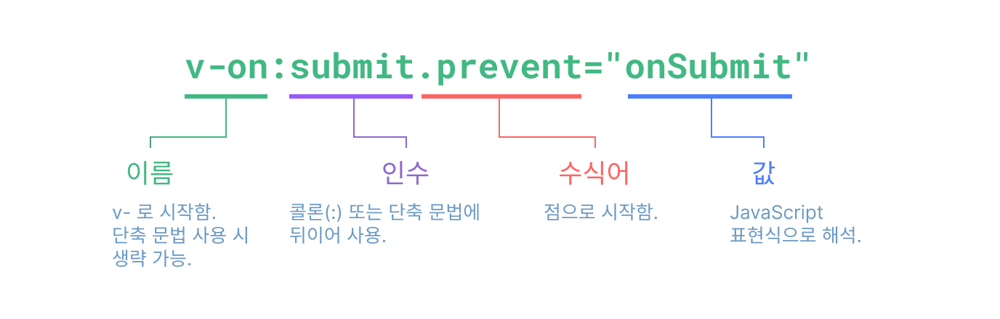

# 템플릿 문법

Vue는 컴포넌트 인스턴스의 데이터를 서술적으로 렌더링된 DOM에 바인딩할 수 있는 HTML 기반 템플릿 문법을 사용합니다.
모든 Vue 템플릿은 사양을 준수하는 브라우저 및 HTML 파서에서 문법을 분석할 수 있는 문법적으로 유효한 HTML입니다.

내부적으로 Vue는 템플릿을 고도로 최적화된 JavaScript 코드로 컴파일합니다.
반응형 시스템과 결합된 Vue는 앱 상태의 변경 사항을 적용할 때, 다시 렌더링할 필요가 있는 최소한의 컴포넌트를 지능적으로 파악하고 DOM 조작을 최소화 합니다.

가상 DOM 개념에 익숙하고 JavaScript의 원시적인 작동법을 선호하는 경우, JSX 지원 옵션을 사용하여 템플릿 대신 [렌더링 함수를 직접 작성](/guide/extras/render-function.html)할 수도 있습니다.
그러나 템플릿과 동일한 수준의 컴파일 시간 최적화를 기대할 수 없다는 점에 유의하십시오.

## 텍스트 보간법

데이터 바인딩의 가장 기본적인 형태는 "Mustache"(이중 중괄호) 문법을 사용한 텍스트 보간법입니다:

```vue-html
<span>메세지: {{ msg }}</span>
```

이중 중괄호 태그 내 `msg`는 해당 컴포넌트 인스턴스의 `msg` 속성의 값으로 대체됩니다.
또한 `msg` 속성이 변경될 때마다 업데이트됩니다.

## HTML 출력

이중 중괄호는 데이터를 HTML이 아닌 일반 텍스트로 해석합니다.
실제 HTML을 출력하려면 [`v-html` 지시문](/api/built-in-directives.html#v-html)을 사용해야 합니다:

```vue-html
<p>텍스트 보간법 사용: {{ rawHtml }}</p>
<p>v-html 지시문 사용: <span v-html="rawHtml"></span></p>
```

<script setup>
  const rawHtml = '<span style="color: red">이것은 빨간색이어야 합니다.</span>'
</script>

<div class="demo">
  <p>텍스트 보간법 사용: {{ rawHtml }}</p>
  <p>v-html 지시문 사용: <span v-html="rawHtml"></span></p>
</div>

여기서 우리가 보고있는 `v-html`이라는 새로운 속성은 **지시문**이라고 합니다.
지시문은 Vue에서 제공하는 특수한 속성임을 나타내기 위해 접두사 `v-`를 사용하며, 짐작했듯이 지시문은 렌더링된 DOM에 특별한 반응적 동작을 적용합니다.
여기서 우리가 설명하고자 하는 것은 "현재 활성화 상태인 인스턴스의 `rawHtml` 속성을 사용하여 이 엘리먼트 내부의 HTML을 최신 상태로 유지합니다."입니다.

`span` 내부의 컨텐츠는 `rawHtml` 속성 값을 일반 HTML로 해석한 것으로 대체됩니다.
데이터 바인딩은 무시됩니다.
Vue는 문자열 기반 템플릿 엔진이 아니기 때문에 `v-html`을 사용하여 템플릿의 일부분을 작성할 수 없습니다.
따라서 UI 재사용 및 구성을 위한 기본 단위로 컴포넌트가 선호됩니다.

:::warning 보안 경고
웹사이트에서 임의의 HTML을 동적으로 렌더링하면 [XSS 취약점](https://en.wikipedia.org/wiki/Cross-site_scripting)이 쉽게 발생할 수 있으므로 매우 위험할 수 있습니다.
신뢰할 수 있는 콘텐츠에만 `v-html`을 사용하고 사용자가 제공한 콘텐츠에는 **절대** 사용하지 마세요.
:::

## 속성 바인딩

이중 중괄호는 HTML 속성(attribute) 내에서 사용할 수 없습니다.
대신 [`v-bind` 지시문](/api/built-in-directives.html#v-bind)을 사용하세요:

```vue-html
<div v-bind:id="dynamicId"></div>
```

`v-bind` 지시문은 엘리먼트의 `id` 속성을 컴포넌트의 `dynamicId` 속성과 동기화된 상태로 유지하도록 Vue에 지시합니다.
바인딩된 값이 `null` 또는 `undefined`이면 엘리먼트의 속성이 제거된 상태로 랜더링 됩니다.

### 단축 문법

`v-bind`는 매우 일반적으로 사용되기 때문에 전용 단축 문법이 있습니다:

```vue-html
<div :id="dynamicId"></div>
```

`:`로 시작하는 속성은 일반 HTML과 약간 다르게 보일 수 있지만, 실제로는 유효한 속성명 문자열이며, Vue를 지원하는 모든 브라우저에서 올바르게 파싱 할 수 있습니다.
또한 최종 렌더링된 마크업에는 표시되지 않습니다.
단축 문법은 선택 사항이지만 사용할 경우 유용할 것입니다.

> 이후 가이드 내용에서는 Vue 개발자에게 가장 일반적으로 사용되는 단축 문법을 코드 예제에서 사용할 것입니다.

### 불리언(Boolean) 속성

[불리언 속성](https://html.spec.whatwg.org/multipage/common-microsyntaxes.html#boolean-attributes)은 엘리먼트에 표기했는지 여부로 참/거짓 값을 나타내는 속성입니다.
예를 들어, [`disabled`](https://developer.mozilla.org/en-US/docs/Web/HTML/Attributes/disabled)는 가장 일반적으로 사용되는 불리언 속성 중 하나입니다.

`v-bind`는 이러한 경우 약간 다르게 작동합니다:

```vue-html
<button :disabled="isButtonDisabled">버튼</button>
```

`isButtonDisabled`에 [truthy 값](https://developer.mozilla.org/en-US/docs/Glossary/Truthy)이 있는 경우, `disabled` 속성이 표기됩니다.
값이 빈 문자열인 경우 `<button disabled="">`의 일관성을 유지하므로 속성이 표기됩니다.
그 외 [falsy 값](https://developer.mozilla.org/en-US/docs/Glossary/Falsy)의 경우 속성이 생략됩니다.

### 여러 속성을 동적으로 바인딩

아래와 같이 여러 속성을 나타내는 JavaScript 객체가 있는 경우:

<div class="composition-api">

```js
const objectOfAttrs = {
  id: 'container',
  class: 'wrapper'
}
```

</div>
<div class="options-api">

```js
data() {
  return {
    objectOfAttrs: {
      id: 'container',
      class: 'wrapper'
    }
  }
}
```

</div>

인수 없이 `v-bind`를 사용하여 단일 엘리먼트에에 바인딩할 수 있습니다:

```vue-html
<div v-bind="objectOfAttrs"></div>
```

## JavaScript 표현식 사용

지금까지는 템플릿의 간단한 속성 키에만 바인딩했습니다.
그러나 Vue는 실제로 모든 데이터 바인딩 내에서 JavaScript 표현식의 모든 기능을 지원합니다:

```vue-html
{{ number + 1 }}

{{ ok ? '예' : '아니오' }}

{{ message.split('').reverse().join('') }}

<div :id="`list-${id}`"></div>
```

이러한 표현식은 현재 컴포넌트 인스턴스의 데이터 범위에서 JavaScript로 평가됩니다.

Vue 템플릿에서 JavaScript 표현식은 다음과 같은 위치에 사용할 수 있습니다:

- 이중 중괄호(텍스트 보간법) 내부
- 모든 Vue 지시문 속성(`v-`로 시작하는 특수 속성) 내부

### 하나의 표현식만 가능

각 바인딩에는 **하나의 단일 표현식**만 포함될 수 있으므로 다음은 **작동하지 않습니다**:

```vue-html
<!-- 이것은 표현식이 아니라 선언식입니다: -->
{{ var a = 1 }}

<!-- 흐름 제어도 작동하지 않습니다. 삼항 표현식을 사용하십시오. -->
{{ if (ok) { return message } }}
```

### 함수 호출

바인딩 표현식 내부에서 컴포넌트에서 노출하는 메서드를 호출할 수 있습니다:

```vue-html
<span :title="toTitleDate(date)">
  {{ formatDate(date) }}
</span>
```

:::tip
바인딩 표현식 내부에서 호출되는 함수는 컴포넌트가 업데이트될 때마다 호출되므로, 데이터를 변경 또는 비동기 작업을 트리거하는 등의 **부작용이 없어야 합니다**.
:::

### 제한된 글로벌 액세스

템플릿 표현식은 샌드박스 처리되어 [제한된 글로벌 리스트](https://github.com/vuejs/core/blob/main/packages/shared/src/globalsWhitelist.ts#L3)에만 액세스할 수 있습니다.
이 목록은 `Math` 및 `Date` 등 일반적으로 사용되는 기본 제공 글로벌 객체를 표시합니다.

리스트에 명시적으로 포함되지 않은 `window`와 같은 글로벌 속성은 템플릿 표현식에서 액세스할 수 없습니다.
그러나 [`app.config.globalProperties`](/api/application.html#app-config-globalproperties)에 추가하여, Vue 내부의 모든 표현식에서 글로벌 속성에 액세스 할 수 있도록 명시적으로 정의할 수 있습니다.

## 지시문

`v-` 접두사가 있는 특수한 속성을 지시문이라 합입니다.
Vue는 위에서 소개한 `v-html`과 `v-bind`를 포함하여 [빌트인 지시문](/api/built-in-directives.html)을 제공합니다.

지시문 속성 값은 단일 JavaScript 표현식이어야 합니다(나중에 해당 섹션에서 설명할 `v-for`, `v-on` 및 `v-slot` 제외).
지시문의 역할은 표현식 값이 변경될 때 DOM에 반응적으로 업데이트를 적용하는 것입니다.
[`v-if`](/api/built-in-directives.html#v-if)를 예로 들어 보겠습니다.

```vue-html
<p v-if="seen">이제 이것을 볼 수 있습니다.</p>
```

여기서 `v-if` 지시문은 `seen`의 불리언(truthy/falsy) 값을 기반으로 `<p>` 엘리먼트를 삽입 또는 제거합니다.

### 인수

일부 지시문은 지시문 뒤에 콜론(`:`)으로 표시되는 "인수"를 사용할 수 있습니다.
예를 들어 `v-bind` 지시문은 HTML 속성을 반응적으로 업데이트하는 데 사용됩니다:

```vue-html
<a v-bind:href="url"> ... </a>

<!-- 단축 문법 -->
<a :href="url"> ... </a>
```

여기서 `href`는 `v-bind` 지시문의 인수로서, 엘리먼트의 속성인 `href`에 `url`의 값을 바인딩한 것입니다.
간단하게 인수 앞의 `v-bind:`는 `:`로 줄여 쓸 수 있습니다.

또 다른 예로는 DOM 이벤트를 수신하는 `v-on` 지시문입니다:

```vue-html
<a v-on:click="doSomething"> ... </a>

<!-- 단축 문법 -->
<a @click="doSomething"> ... </a>
```

`v-on`은 단축 문법이 있는 몇 안 되는 지시문 중 하나이며 `@`로 줄여 쓸 수 있습니다.
여기서 `click`은 인수로서 수신할 이벤트 이름입니다.
이벤트 처리에 대해서는 나중에 더 자세히 설명하겠습니다.

### 동적인 인수

지시문의 인수를 대괄호로 감싸서 JavaScript 표현식으로 사용할 수도 있습니다:

```vue-html
<!--
아래의 "동적인 인수 값 제약 조건" 및 "동적인 인수 문법 제약 조건" 섹션에 설명된 대로,
인수 표현식에는 몇 가지 제약 사항이 있음에 유의하십시오.
-->
<a v-bind:[attributeName]="url"> ... </a>

<!-- 단축 문법 -->
<a :[attributeName]="url"> ... </a>
```

여기서 `attributeName`은 JavaScript 표현식으로 동적으로 평가되며, 평가된 값은 인수의 최종값으로 사용됩니다.
예를 들어 컴포넌트 인스턴스의 데이터에 `attributeName` 속성값이 `"href"`인 경우, 이 바인딩은 `v-bind:href`와 같습니다.

마찬가지로 동적인 인수를 사용하여, 핸들러에 이벤트 이름을 동적으로 바인딩할 수 있습니다:

```vue-html
<a v-on:[eventName]="doSomething"> ... </a>

<!-- 단축 문법 -->
<a @[eventName]="doSomething">
```

이 예에서 `eventName`의 값이 `"focus"`인 경우, `v-on:[eventName]`은 `v-on:focus`와 같습니다.

#### 동적인 인수 값 제약 조건

동적인 인수는 `null` 또는 문자열로 평가되어야 합니다.
값이 `null`일 경우, 바인딩을 명시적으로 제거합니다.
문자열이 아닌 다른 값은 애러를 트리거합니다.

#### 동적인 인수 문법 제약 조건

동적인 인수 표현식에는 공백 및 따옴표와 같은 특정 문자가 HTML 속성 이름 내에서 유효하지 않기 때문에 문법에 일부 제약 조건이 있습니다.
예를 들어 다음은 유효하지 않습니다:

```vue-html
<!-- 이렇게 하면 컴파일러 경고가 트리거됩니다. -->
<a :['foo' + bar]="value"> ... </a>
```

복잡한 동적인 인수를 전달해야 하는 경우 [computed 속성](./computed.html)을 사용하는 것이 더 나을 것입니다.
이에 대해서는 곧 다룰 것입니다.

DOM 내 템플릿(HTML 파일에 직접 작성된 템플릿)을 사용할 때, 브라우저가 속성 이름을 소문자로 강제 변환하므로 대문자로 키 이름을 지정하는 것도 피해야 합니다:

```vue-html
<a :[someAttr]="value"> ... </a>
```

위의 내용은 DOM 내 템플릿에서 `:[someattr]`로 변환됩니다.
컴포넌트에 `someAttr` 속성을 정의했다면, `someattr` 속성은 없으므로 코드가 작동하지 않습니다.

### 수식어

수식어는 점(`.`)으로 시작하는 특수한 접미사로, 지시문이 특별한 방식으로 바인딩되어야 함을 나타냅니다.
예를 들어 `.prevent` 수식어는 트리거된 이벤트에서 `event.preventDefault()`를 호출하도록 `v-on` 지시문에 지시합니다.

```vue-html
<form @submit.prevent="onSubmit">...</form>
```

추후 이러한 기능에 대해 찾아볼 때, [`v-on`](./event-handling.html#이벤트-수식어) 또는 [`v-model`](./forms.html#수식어) 전용의 다른 수식어에 대한 예제를 접할 수 있습니다.

마지막으로 다음은 전체적인 지시문 문법을 시각화한 것입니다:



<!-- https://www.figma.com/file/BGWUknIrtY9HOmbmad0vFr/Directive -->
<!-- https://www.figma.com/file/al5C8iirhnfOKZ6izKwDw4/Directive-(ko-kr) -->
